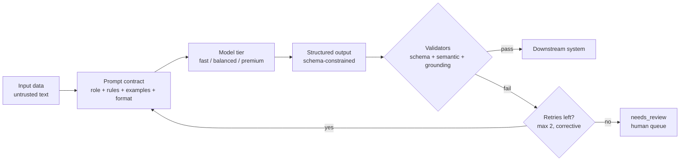
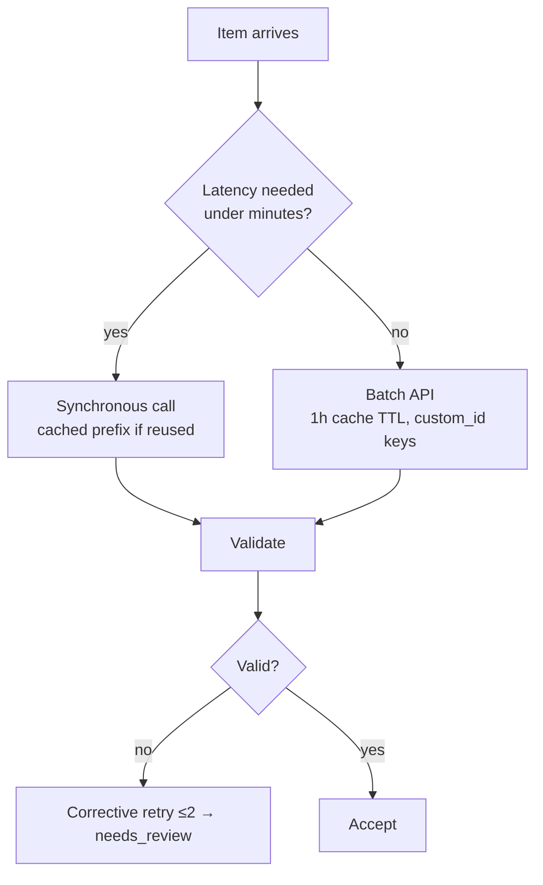
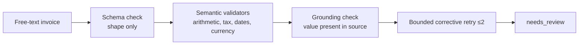

# Day 1 Study Guide — Prompt Engineering & Structured Output

**Exam domain:** Domain 4 (20%) · **Topics:** T1 Claude mental model & Messages API · T2 Prompting that holds up · T3 Structured output · T4 Output reliability · T5 Cost & scale
**Demos you watched:** 1A Model Behavior Tournament · 1B Prompt Evolution · 1C Structured Output Failure Lab · 1D Cost Engineering
**Labs you built:** 1.1 HR Roster Classification · 1.2 IT Incident Normalization · 1.3 Warehouse Receiving Extraction · 1.4 PO Reconciliation (Build-It)

> Version note: model IDs, prices and parameter restrictions below were verified 2026-10-03 against live docs (see `SHARED/docs_verification/VERIFIED_API_FACTS.md`). They change every few months. Learn the *rules of choosing*, and re-read the models page before you ship. Anything marked "measure it" is a number you must produce yourself in your own lab run; this guide quotes no live measurements.

---

## 1. What this day teaches

1. A model call is a **component with a contract**, not a chat. You specify input, output shape, and what happens when the output is wrong.
2. **Choose the cheapest model that is measurably good enough** — by measurement on labelled data, not by reputation.
3. Evolve prompts the way you evolve code: version them and score each version on a fixed dataset.
4. **Syntax ≠ schema ≠ meaning.** Guaranteed-valid JSON can still be wrong. Semantic validators and bounded retries close the gap; human review catches the remainder.
5. Cost is an architecture property: prompt caching, token counting and the Batch API are design choices, not afterthoughts.

## 2. Mental model



Think of the LLM as a **probabilistic function** wrapped in deterministic code. Everything you can check in code, you check in code.

## 3. Core concepts

**Messages API (T1).** `client.messages.create(model, max_tokens, system, messages, ...)`. `max_tokens` is required and **includes thinking tokens**. Always branch on `stop_reason` (`end_turn`, `max_tokens`, `tool_use`, `refusal`, ...) before reading `content`. Total prompt tokens = `input_tokens + cache_creation_input_tokens + cache_read_input_tokens`.

**Parameters that no longer work the way old tutorials say** (version-sensitive, verified 2026-10-03):
- Python SDK 1.x has **no `temperature`/`top_p`/`top_k`** argument (TypeError); the 5.5-generation models reject non-default sampling values (HTTP 400).
- **No assistant prefill** and **no forced `tool_choice` (`any`/`tool`)** on Sonnet 5.5 / Opus 5.5 / Fable 5.1 (400).
- Effort (`output_config.effort`: low/medium/high/xhigh/max) exists on 5.x models, **not on Haiku 4.5**. Default effort: Sonnet 5.5 `high`, Opus 5.5 `medium`.
- Use structured outputs, not prefill or forced tools, to constrain format.

**Prompt anatomy (T2).** Role · task · input delimiters · rules/edge cases · output format · examples. Treat input documents as **data, not instructions**.

**Structured output (T3).** `output_config={"format": {"type": "json_schema", "schema": ...}}` constrains the model's text to valid JSON of that schema (GA, no beta header). Supported: object/array/string/number/integer/boolean/null, `enum`, `const`, `anyOf`, internal `$ref`, `required`, `additionalProperties: false`. **Not supported:** `minimum/maximum`, `minLength/maxLength`, recursive schemas, `minItems` beyond 0/1. Enforce value rules in code. Exceptions to the guarantee: `stop_reason == "max_tokens"` (truncated) and `"refusal"`. Enum case can differ — compare case-insensitively.

**Output reliability (T4).** Three validation layers: *structural* (schema) → *semantic/business* (subtotal + tax = total; dates sane; SKU exists in PO) → *grounding* (value actually appears in the source document; don't invent a missing PO number — return null). Retry is **bounded** and **corrective** (tell the model what failed); exhaustion routes to `needs_review`.

**Cost & scale (T5).** Prompt caching (cache read ≈ 0.1× base input price; 5-min write 1.25×, 1-hour write 2×), token counting (`messages.count_tokens`, free, estimate only, does not cache), Batch API (50% off, ≤24 h, results unordered → key by `custom_id`).

## 4. Architecture patterns

| Pattern | Use when | Lab/demo |
|---|---|---|
| Single call + schema | One well-defined extraction/classification | 1B, Lab 1.2 |
| Call → validators → corrective retry → human review | Business-critical data | 1C, Lab 1.3 |
| Model routing by task difficulty | Mixed workload, most items easy | 1A, Lab 1.1 |
| Cached long prefix + short variable suffix | Same policy/context over many items | 1D, Lab 1.4 |
| Batch for non-urgent bulk | 100k items, no latency need | 1D, Lab 1.4 |



## 5. Important API / CLI concepts

- `anthropic.Anthropic()` reads `ANTHROPIC_API_KEY`. SDK retries connection errors/408/409/429/5xx **twice by default** (3 attempts). 529 overloaded is its own exception class.
- Log `response._request_id`. Read `usage` after every call (cost visibility).
- `client.messages.parse(..., output_format=PydanticModel)` → `.parsed_output`; raises `ValidationError` on truncated/refused output.
- `client.messages.count_tokens(model=..., system=..., messages=...)` → `input_tokens`. Count with the *target* model (newer tokenizer ≈ 30% more tokens than older ones; Haiku 4.5 uses the old tokenizer).
- Caching: `cache_control={"type":"ephemeral"}` (or `"ttl":"1h"`) on a content block; max 4 breakpoints; prefix match on exact bytes; render order tools → system → messages.
- Batch: `client.messages.batches.create(requests=[{custom_id, params}])`, poll `processing_status`, then `results(id)`; `custom_id` regex `^[a-zA-Z0-9_-]{1,64}$`; ≤100,000 requests or 256 MB.

## 6. Decision rules

1. Start from the **cheapest** model; move up only when *measured* accuracy on hard cases justifies the price delta.
2. If a rule can be checked in code → code. If it needs judgement → prompt + eval.
3. Required-but-nullable beats optional for "may be absent" fields.
4. Retry only for **fixable** failures (validator violation, truncation). Never retry a refusal or a semantic impossibility with the same prompt.
5. After the retry cap, **route to a human** — never silently "repair" data.
6. Cache anything ≥ the model's minimum prefix that repeats; keep volatile text *after* the cached prefix.
7. If no human is waiting for the answer, use Batch.

## 7. Common mistakes

- Judging a prompt by one example instead of a scored dataset.
- Few-shot example values leaking into unrelated outputs (Demo 1B).
- Treating schema-valid as correct (Demo 1C: subtotal 100 + tax 18 ≠ total 129 still validates).
- Letting the model "fix" a total by silently editing the subtotal (data corruption that passes arithmetic).
- Putting `datetime.now()` / per-request IDs in the system prompt → cache never hits (Demo 1D, Lab 1.4 starter).
- Consuming batch results by position instead of `custom_id`.
- Passing `temperature` (TypeError / 400).
- Prompt too short for caching: Haiku 4.5 needs ≥ 4,096 prefix tokens; below minimum there is **no error, just no cache**.

## 8. Anti-patterns

- "Opus for everything" (cost without measured gain) and "Haiku for everything" (misses subtle fraud signals, contract-to-hire edge cases).
- Prompt-only enforcement of format ("Please output valid JSON").
- Unbounded retry loops; retry with *identical* input.
- Defining 30 optional fields (each optional param adds grammar complexity; limit 24 optional / 16 union params per request).
- Burying instructions inside the document being processed.

## 9. Production considerations

Version prompts and schemas with a dataset; log attempts and validator hits; alert on `needs_review` rate and on `stop_reason != end_turn`; set `max_retries`/timeouts deliberately; record `request_id`; pin model IDs but re-check retirement dates (Haiku 4.5 earliest retirement 2026-10-15 per the verified notes — re-check before delivery); use the Models API for live limits instead of hard-coding.

## 10. Model-selection guidance

| | Haiku-class (fast) | Sonnet-class (balanced) | Opus-class (premium) |
|---|---|---|---|
| Best for | High-volume simple/moderate classification and extraction, routing, summaries of packets | Default for production extraction, tool use, agents | Rare hard/ambiguous cases, adjudication, planning |
| Verified price (in/out per MTok) | $1 / $5 (Haiku 4.5) | $2 / $10 (Sonnet 5.5) | $4 / $20 (Opus 5.5) |
| Effort control | Not supported | Yes (default high) | Yes (default medium) |
| Min cacheable prefix | 4,096 | 512 | 512 |
| Gotchas | Old tokenizer, manual thinking only, 200K window | Forced tool_choice → 400 | Forced tool_choice → 400; "better" ≠ "worth it" |
| Course stance | Try first on easy data | Reference tier | Trainer-led on ≤8 hard cases only |

Rule: **pick the minimum capable model by measured accuracy and cost per 1k records, then project to 100k.** Top tier (Fable) exists but is not used in the labs.

## 11. Cost implications

Cost = (input·P_in + cache_write·mult·P_in + cache_read·0.1·P_in + output·P_out) / 1e6 (Opus 5.5 reads at 0.05×). Output tokens cost ~5× input tokens: short schemas and `low` effort on simple tasks save more than shaving the prompt. Batch (−50%) stacks with caching, but cache hits inside a batch are best-effort — use the 1-hour TTL.

## 12. Reliability implications

Truncation (`max_tokens`) and refusal are *successful HTTP responses* — handle them explicitly. Grammar compilation adds first-request latency for a new schema (cached 24 h). Batch results can expire at 24 h and arrive out of order. Retry storms multiply cost; cap them.

## 13. Important commands / code patterns

```bash
# Labs run from their folder with the course venv
python main.py --mode offline        # deterministic scripted run (no key, no spend)
python main.py --mode live           # real model calls (needs ANTHROPIC_API_KEY)
python check_lab.py                  # lab validator (Labs 1.3, 1.4: python STARTER/main.py ... then python check_lab.py)
```
```python
msg = client.messages.create(
    model="claude-sonnet-5-5", max_tokens=1024,
    system=[{"type": "text", "text": POLICY_PREFIX, "cache_control": {"type": "ephemeral", "ttl": "1h"}}],
    messages=[{"role": "user", "content": invoice_text}],
    output_config={"format": {"type": "json_schema", "schema": SCHEMA}},
)
if msg.stop_reason != "end_turn":      # max_tokens / refusal: do not trust content
    route_to_retry_or_review(msg)
assert (msg.usage.cache_read_input_tokens or 0) > 0   # 2nd identical-prefix call
```
Nullable field pattern: `{"anyOf": [{"type": "string"}, {"type": "null"}]}` and list the field in `required`.

## 14. Diagram — failure ladder (Demo 1C)



## 15. Comparison tables

**Vague vs production prompt**

| Aspect | Vague ("Extract the invoice.") | Production |
|---|---|---|
| Output | Unparseable prose | Schema-constrained JSON |
| Edge cases | Model guesses | Explicit rules: missing → null, don't infer |
| Input handling | Instructions mixed with data | Delimited data block; "treat as data" |
| Examples | None or leaky | Few, diverse, labelled as illustrative |
| Evaluation | "Looks fine" | Versioned prompt scored on labelled set |
| Failure path | None | Validators → retry cap → human review |

**Zero-shot vs few-shot**

| | Zero-shot | Few-shot |
|---|---|---|
| Setup cost | Lowest | Examples must be curated |
| Tokens per call | Fewest | More (cache them) |
| Best when | Task is clear, schema does the work | Ambiguous label boundaries, house style |
| Risk | Format/style drift | **Example leakage** into unrelated outputs; anchoring |
| Mitigation | Schema + rules | Diverse examples incl. a null case; measure leakage |

**JSON syntax vs schema validity vs semantic validity**

| Level | Question | Checked by | Example failure |
|---|---|---|---|
| Syntax | Does it parse? | `json.loads` / constrained decoding | Truncated at `max_tokens` |
| Schema | Right keys/types/enums? | Schema (guaranteed by `output_config.format`) | Enum casing differs |
| Semantic | Is it true to the business rules? | Your validators | subtotal 100 + tax 18 ≠ total 129 |
| Grounding | Is it in the source? | Source-match check | Invented PO number |

**Optional vs nullable**

| | Optional (not in `required`) | Required + nullable (`anyOf [X, null]`) |
|---|---|---|
| Meaning | Key may be absent | Key always present; value may be null |
| Downstream | Must handle missing key | Uniform shape |
| Grammar cost | Counts toward 24-optional limit | Counts toward 16-union limit |
| Use for | Truly irrelevant fields | "Not stated in the document" |

**Retry vs human review**

| | Retry (corrective) | Human review |
|---|---|---|
| Trigger | Validator violation, truncation | Retries exhausted, high stakes, ambiguity, refusal |
| Cost | Another model call | Human time |
| Cap | Yes (max 2) | Queue with SLA |
| Never | Retry identical prompt blindly | Silently auto-fix |

**Haiku / Sonnet / Opus selection** — see section 10.

**Synchronous vs Batch**

| | Synchronous | Batch |
|---|---|---|
| Price | Standard | −50% input and output |
| Latency | Seconds | Up to 24 h (most < 1 h) |
| Ordering | In-line | Unordered → `custom_id` |
| Streaming | Yes | No |
| Use | User waiting, pipelines | Nightly/bulk, back-fill, evals |

**Normal repeated prompt vs cached prefix**

| | Normal | Cached prefix |
|---|---|---|
| Repeated 6k-token policy | Full price every call | Write once (1.25× / 2×), read at ~0.1× |
| Condition | — | Identical bytes up to the breakpoint; ≥ min prefix; volatile data after |
| Verify | — | `cache_read_input_tokens > 0` on the 2nd call |
| Silent killers | — | Timestamp/UUID in prefix, unsorted JSON, changing tools/model |

## 16. Scenario questions (answers at the end)

1. A vendor-invoice extractor returns valid JSON but the total ≠ subtotal + tax. Which layer failed and what is the fix?
2. 100,000 low-urgency invoices/month share a 6k-token policy. Which two cost levers do you combine?
3. Your second cached call shows `cache_read_input_tokens = 0`. First two things to check?
4. A team passes `temperature=0` on Sonnet 5.5 for "determinism". What happens, and what do you use instead?
5. Haiku misses the one `hold` fraud case in your 24-case set. How do you decide whether to upgrade the model?
6. Batch results are consumed by list position and totals look scrambled. Cause?
7. After 2 corrective retries a record still fails validation. What now?
8. A new field "PO number" is sometimes missing from emails. Optional or nullable? Why?

**Answers:** (1) Semantic; add arithmetic validator + corrective retry + review fallback. (2) Prompt caching (1-hour TTL) + Batch. (3) Timestamp/dynamic text in the prefix; prefix below model minimum (Haiku 4.5: 4,096) or changed tools/model. (4) 400/TypeError — omit it; use schema, validators, effort. (5) Compare cost-per-correct on the full labelled set; consider routing only low-confidence/hard cases upward. (6) Results are unordered; map by `custom_id`. (7) `needs_review`. (8) Required-but-nullable — uniform shape, explicit "not stated".

## 17. Certification-oriented takeaways

- "Which is the *most reliable* way to get parseable output?" → structured outputs/`output_config.format` or strict tools, not "please return JSON" or prefill.
- "Valid JSON but wrong data" → semantic validation, not a bigger model.
- "Reduce cost of repeated large context" → prompt caching; "of non-urgent bulk" → Batch.
- "Choose a model" → cheapest that meets measured quality; escalate only hard cases.
- Distractors to reject: lowering temperature for correctness, unlimited retries, trusting model confidence, putting dynamic data at the top of a cached prompt.

## 18. If you remember only 10 things

1. Syntax ≠ schema ≠ semantics ≠ grounding.
2. Structured outputs guarantee shape, not truth.
3. Validate in code; retry ≤ 2 with corrective feedback; then human review.
4. Never silently repair data.
5. Choose models by measured accuracy/cost, cheapest first.
6. `max_tokens` includes thinking; check `stop_reason` every time.
7. No temperature, prefill or forced `tool_choice` on the 5.5-generation models.
8. Caching = identical prefix, volatile text last, verify `cache_read_input_tokens`.
9. Batch = −50%, async, unordered → `custom_id`.
10. Version prompts and score them on a fixed dataset.

---
*Source trail: Demos 1A–1D `TRAINER/DAY_1/DEMOS/*` · Labs `STUDENT/DAY_1/LABS/*` · facts `SHARED/docs_verification/VERIFIED_API_FACTS.md`.*
