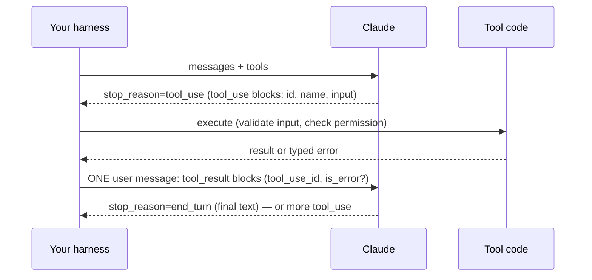
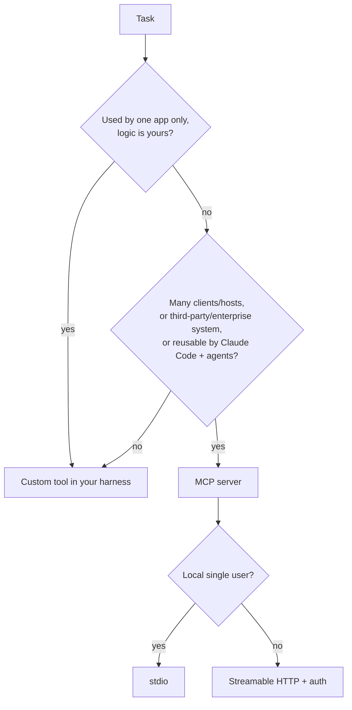
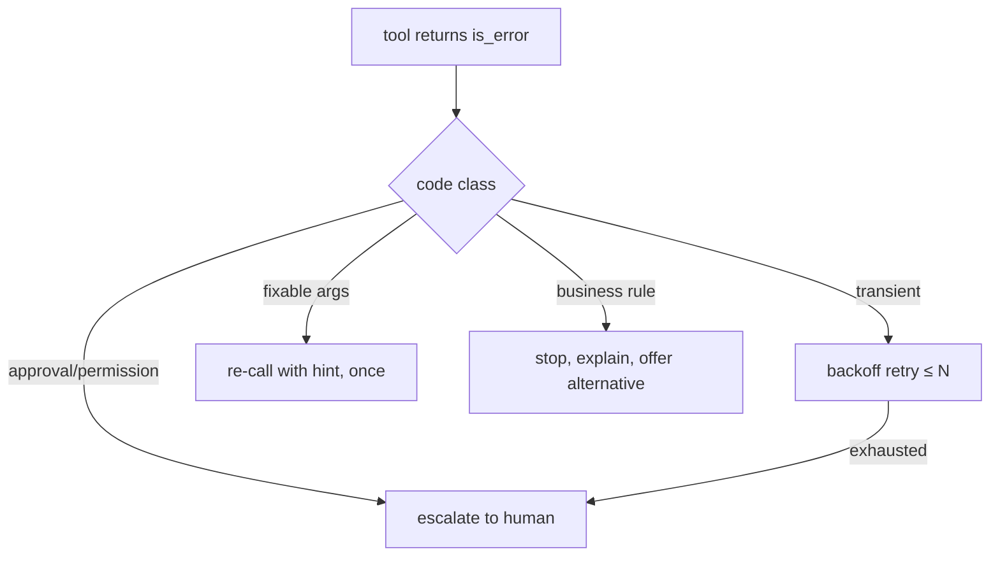

# Day 2 Study Guide — Tool Design & MCP Integration

**Exam domain:** Domain 2 (18%) · **Topics:** T6 Tool-use loop · T7 Tools Claude uses correctly · T8 Structured error handling · T9 Parallel tools & distribution · T10 MCP integration
**Demos:** 2A Bad→Good Tool Architecture · 2B Tool-Use State Machine · 2C Parallel Tool Execution · 2D MCP Zero to Enterprise
**Labs:** 2.1 Facilities Tool Boundaries · 2.2 Travel Disruption Tool Loop · 2.3 Payroll Typed Errors · 2.4 Procurement MCP Server with Auth (Build-It)

> Version-sensitive facts verified 2026-10-03 (`SHARED/docs_verification/VERIFIED_API_FACTS.md`). Offline lab/demo runs use scripted responders — they prove your *code*, not model behaviour. Live results are measured by you.

---

## 1. What this day teaches

1. Claude never executes anything. It **requests** a tool call; your code runs it and returns a result.
2. Tool quality is mostly **definition quality**: names, descriptions, schemas, and *boundaries*.
3. Errors are data: return **typed, structured errors** so the agent can choose retry / change args / escalate.
4. Parallelism is for independent reads; dependent or side-effecting steps stay sequential.
5. **MCP** standardises how tools/resources/prompts are exposed to many clients, with transports and auth you must design.

## 2. Mental model


The loop is a **state machine driven by `stop_reason`**: `tool_use` → run tools and continue; `end_turn` → done; `max_tokens`/`refusal` → handle; plus a **max-iteration guard** you own.

## 3. Core concepts

**Tool lifecycle.** Define (name, description, `input_schema`) → Claude emits `tool_use` → you validate and execute → you return `tool_result` → loop. `tool_choice`: `auto` (default), `any`, `tool`, `none`. **On Sonnet 5.5 / Opus 5.5 / Fable 5.1 only `auto` and `none` are accepted** (forced = HTTP 400); use `strict: true` tools or `output_config.format` to get guaranteed shape.

**tool_result rules (400 if broken).**
- Results must come in the user message *immediately after* the assistant `tool_use` message.
- `tool_use_id` must match the `id` of the call.
- **All results for parallel calls go in ONE user message**; `tool_result` blocks first, any text after.
- Every `tool_use` needs a matching `tool_result` (if you skip a call, return `is_error: true` with an explanation). Orphan or missing results → 400 (Demo 2B).

**Tool schema design.** `name` `^[a-zA-Z0-9_-]{1,128}$`; description answers *what, when to use, when NOT to use, what it returns*; `input_schema` with enums for closed sets, `required` only for truly needed args, `additionalProperties: false` with `strict`. Optional `input_examples` must validate against the schema. Each strict tool counts toward complexity limits (20 strict tools, 24 optional params per request).

**Tool boundary rules (T7).**
1. One tool = one verb on one noun with a clear contract.
2. No two tools may be selectable for the same request (`get_customer` vs `lookup_customer` vs `find_account` is the classic fault).
3. Split read from write; separate irreversible actions and gate them.
4. Prefer a **small, scoped** tool set per agent (Lab 2.1 target: ≤ 7 tools per scope) over one giant list.
5. Put disambiguation in the description ("Use X for…, use Y for…").
6. Return only what the model needs (minimum necessary data).

**Tool selection.** Model chooses by name+description matching intent. Measure it: build an eval prompt set with the expected tool, score selection accuracy before/after redesign (Demo 2A: 20 prompts; Lab 2.1: 16 prompts).

**Structured tool errors (T8).** Return `is_error: true` with a **typed** payload: `{code, message, retryable, hint, ...}`. Errors you practised: `PAYMENT_GATEWAY_TIMEOUT`, `PERMISSION_DENIED`, `CUSTOMER_NOT_FOUND`, `PAY_PERIOD_CLOSED`, `EMPLOYEE_NOT_FOUND`, `HR_APPROVAL_REQUIRED`, `PAYROLL_DB_LOCKED`.

**Retryability.**
| Class | Example | Action |
|---|---|---|
| Transient / environment | `PAYROLL_DB_LOCKED`, timeout | Retry with bounded backoff |
| Fixable by the model | bad argument, `CUSTOMER_NOT_FOUND` with hint | Re-call with corrected args (once or twice) |
| Non-retryable business | `PAY_PERIOD_CLOSED` | Do **not** retry; report/alternative |
| Needs a human | `HR_APPROVAL_REQUIRED`, `PERMISSION_DENIED` | Escalate; never loop |

**Sequential vs parallel (T9).** Claude may return several `tool_use` blocks in one turn. Run **independent read-only** calls concurrently (customer-360: CRM, orders, tickets, billing, shipments). Keep **dependent or side-effecting** chains sequential (reserve stock → charge → confirm). `disable_parallel_tool_use: true` lives *inside* `tool_choice`. Parallelising side effects creates races/double-charges (Demo 2C).

**MCP (T10).** Open protocol (JSON-RPC) between a **host/client** and **servers**. Three server primitives:
| Primitive | Controlled by | Purpose | Example |
|---|---|---|---|
| **Tools** | Model | Actions/queries with side effects or computation | `get_customer`, `create_po` |
| **Resources** | Application/user | Read-only data addressed by URI | `kb://articles/{id}`, `customer://{id}/summary` |
| **Prompts** | User | Reusable templates (appear as slash commands in Claude Code) | "summarise account" |

**Transports.** *stdio*: client launches the server as a subprocess; local, single-user; **stdout is the protocol channel — never `print()` to stdout, log to stderr** (Lab 2.4 / Demo 2D failure). *Streamable HTTP*: networked, multi-client, needs auth, TLS, session handling; **SSE is deprecated**.

**Authentication / authorization / security.** Authentication = who are you (401 without a key); authorization = what may you do (403 for wrong role). Use per-role scopes, never log secrets (redact), expose minimum necessary data in resources, treat tool results/resources as **untrusted input** (prompt injection), validate every tool input server-side, return details-free denials. Remote Claude Code servers support OAuth 2.0 or static headers.

## 4. Architecture patterns



**TOOL vs MCP decision table**

| Situation | Custom tool (in-process) | MCP server |
|---|---|---|
| One application, one team | **Best** — simplest, fastest, no protocol | Overkill |
| Same capability needed by Claude Code, IDE, chat and agents | Duplicate glue N×M | **Best** — write once |
| Third-party/enterprise data exposed to many consumers | Hard to govern | **Best** — central auth, audit |
| Need read-only browsable context (docs, KB) | Awkward as a tool | Resources |
| Reusable prompt templates | Ad hoc | Prompts |
| Latency-critical hot path | In-process, no hop | Extra hop (stdio local is small; HTTP larger) |
| Security boundary needed (separate process/creds) | Shares your process | **Better isolation**, per-server credentials |
| Fast prototype / unit-testable pure function | **Best** | Later |
| Needs multi-user auth and role scoping | You build it | Built into HTTP transport design (you still implement authz) |
| Tool set changes without redeploying the agent | Redeploy | Server updates independently (client re-lists) |
| Many tools bloat context | Scope by agent | Claude Code tool search defers MCP tools until needed |

Rule of thumb: **Tool = code in your agent. MCP = capability as a service.**

## 5. Important API / CLI concepts

```python
# Tool loop skeleton (offline lab: python STARTER/main.py --mode offline)
for _ in range(MAX_ITERATIONS):                      # guard
    resp = client.messages.create(model=M, max_tokens=1024, tools=TOOLS, messages=msgs)
    msgs.append({"role": "assistant", "content": resp.content})
    if resp.stop_reason != "tool_use":
        break
    results = [run_tool(b) for b in resp.content if b.type == "tool_use"]   # may parallelise reads
    msgs.append({"role": "user", "content": results})   # ONE message, tool_result blocks
```
```json
{"type":"tool_result","tool_use_id":"toolu_…","is_error":true,
 "content":"{\"code\":\"PAY_PERIOD_CLOSED\",\"retryable\":false,\"hint\":\"Post to next open period or escalate to payroll lead\"}"}
```
Claude Code side: `claude mcp add --transport http <name> <url> [--header "Authorization: Bearer …"]` · `claude mcp add --transport stdio <name> -- <command>` · `claude mcp list|get|remove` · scopes `local|project|user` (project = `.mcp.json`) · tool names `mcp__<server>__<tool>`.

## 6. Decision rules

1. Tool descriptions are prompts — write them like docs for a new hire.
2. Overlap → consolidate; many unrelated tools → scope per agent/subagent.
3. Errors: classify first (transient / fixable / business / human), then pick the response.
4. Parallelise only when calls are **independent AND side-effect-free**.
5. Enforce permissions and validation **in the tool/server**, not in the prompt.
6. Choose MCP for reuse, governance and isolation; custom tool for local simplicity.
7. HTTP MCP ⇒ authentication is mandatory; stdio ⇒ protocol-clean stdout.

## 7. Common mistakes

- Returning tool results in separate messages / with the wrong `tool_use_id` (400).
- Retrying `PAY_PERIOD_CLOSED` forever; returning bare strings like "error".
- 12 overlapping tools with vague descriptions.
- `print()` debug lines on a stdio MCP server; API keys in logs.
- Parallelising reserve → charge → confirm.
- Assuming authentication = authorization (a valid key does not grant every role's data).
- Using forced `tool_choice` on 5.5-generation models.

## 8. Anti-patterns

God-tool (`do_anything(action, payload)`); tools that return whole database rows; prompt-only permission rules ("never refund > $500"); unbounded tool loop; swallowing tool errors so the model hallucinates success; one MCP server exposing admin and read-only tools to the same credential; trusting resource content as instructions.

## 9. Production considerations

Max-iteration and budget guard; per-tool timeouts; idempotency keys on side-effecting tools; audit log of calls (without secrets); schema versioning; rate limiting and per-role scopes on MCP HTTP; secret redaction test; output size limits (Claude Code caps MCP output at 25,000 tokens by default); health/reconnect handling; contract tests for each tool.

## 10. Model-selection guidance

Tool-calling loops default to **Sonnet-class** (course default; all Day 2 demos/labs except where Lab 2.1 compares Haiku vs Sonnet on selection accuracy). Haiku-class can work for narrow, well-described toolsets — *measure selection accuracy first*. Opus-class is rarely justified for tool selection; a better tool set beats a bigger model. Sonnet 5.5/Opus 5.5 reject forced `tool_choice`.

## 11. Cost implications

Every tool definition is input tokens on every call — 12 tools cost more than 5 and also confuse selection. Cache the (stable) tools+system prefix; changing tools invalidates the whole cache. Each loop turn re-sends history, so long loops grow superlinearly. Parallel calls save latency, not tokens. MCP tool search can defer large tool catalogs.

## 12. Reliability implications

Typed errors make recovery deterministic. Bounded retries prevent storms. Idempotency prevents double effects on retry. stdio servers die with their host; HTTP servers need reconnect logic. Claude may self-retry invalid calls 2–3 times, so keep error messages instructive.

## 13. Important commands / code patterns

```bash
python STARTER/main.py --mode offline      # Labs 2.1 / 2.3 (run from the lab folder; on Windows use STARTER\main.py)
python check_lab.py                        # validator; Lab 2.4 checks: capability list, 401 no key, 403 wrong role, no secret in logs
claude mcp add --transport stdio procurement -- python server.py
claude mcp add --transport http crm https://host/mcp --header "Authorization: Bearer $TOKEN"
```
See each lab's `LAB_GUIDE.md` for the exact per-lab commands.

## 14. Diagram — typed-error recovery



## 15. Comparison tables

**Good vs bad tool boundary**

| Bad | Good |
|---|---|
| `get_customer`, `lookup_customer`, `find_account` | `get_customer(id)` + `search_customers(query)` with "use when" text |
| `manage_order(action=…)` | `get_order`, `cancel_order`, `refund_order` |
| 12 tools to every agent | ≤ 7 per scope; order/billing/shipping scopes |
| "Gets data" | "Returns order status and line items for one order id. Use when … Do not use for refunds." |

**Sequential vs parallel**

| | Sequential | Parallel |
|---|---|---|
| Use for | Dependent steps, side effects, ordered writes | Independent read-only lookups |
| Latency | Sum of calls | Max of calls |
| Risk | Slow | Races, duplicate effects if misused |
| Result handling | One tool_result per turn | **All tool_results in one user message** |

**Authentication vs authorization**

| | Authentication | Authorization |
|---|---|---|
| Question | Who? | May they? |
| Failure | 401 | 403 |
| Lab check | No key → 401 | Wrong role → 403 |

**stdio vs network (streamable HTTP)**

| | stdio | Streamable HTTP |
|---|---|---|
| Deployment | Local subprocess | Remote service |
| Users | One | Many |
| Auth | Process trust / env | API key, OAuth, headers; TLS |
| Pitfall | stdout corruption | Secret leakage, session scaling |

**MCP tools / resources / prompts** — see section 3.

## 16. Scenario questions

1. Your agent gets HTTP 400 after a turn with three parallel tool calls. Likely cause?
2. Payroll tool returns `PAY_PERIOD_CLOSED`; the agent retries 10×. What is missing from the design?
3. Two teams need the same CRM lookup in Claude Code, a chatbot and a batch agent. Tool or MCP?
4. A stdio MCP server "randomly" fails to initialise after you added debug output. Why?
5. A valid API key lets a junior user read salary data via MCP. Which control failed?
6. Which calls may run in parallel: reserve stock, charge card, confirm, plus five customer lookups?
7. Tool selection accuracy is 55% with 12 tools. Cheapest first fix?

**Answers:** (1) Results not all in one user message / mismatched or missing `tool_use_id`. (2) Typed errors with `retryable: false` and a non-retry rule in the harness. (3) MCP (reuse, governance). (4) `print()` to stdout corrupts JSON-RPC; log to stderr. (5) Authorization/role scoping (not authentication). (6) Only the five lookups; reserve→charge→confirm is sequential. (7) Consolidate/rewrite/scope tools and re-measure — before changing models.

## 17. Certification-oriented takeaways

- Questions about "agent keeps picking the wrong tool" → improve descriptions/boundaries/scoping, not temperature or model.
- "Tool failed" → structured error with retryability, not a thrown exception or free-text.
- "Parallel" → only independent reads.
- "Expose to many clients" → MCP; "secure remote MCP" → HTTP + auth + least privilege + redaction.
- Distractors: prompt-based security, retrying everything, giving every tool to every agent.

## 18. If you remember only 10 things

1. Claude requests; your code executes.
2. `stop_reason: tool_use` drives the loop; cap iterations.
3. All parallel `tool_result`s in ONE user message, IDs matching.
4. Tool boundaries beat bigger models.
5. Description = when to use, when not to.
6. Typed errors: code, retryable, hint.
7. Retry transient only; escalate approvals/permissions.
8. Parallelise reads, serialise writes.
9. MCP = tools + resources + prompts; stdio for local, streamable HTTP for shared; SSE deprecated.
10. Authenticate (401), authorize (403), redact secrets, never print to stdout on stdio.

---
*Source trail: `TRAINER/DAY_2/DEMOS/*` · `STUDENT/DAY_2/LABS/*` · `SHARED/docs_verification/VERIFIED_API_FACTS.md` §7, §11 · `VERIFIED_CLAUDE_CODE_FACTS.md` §9.*
