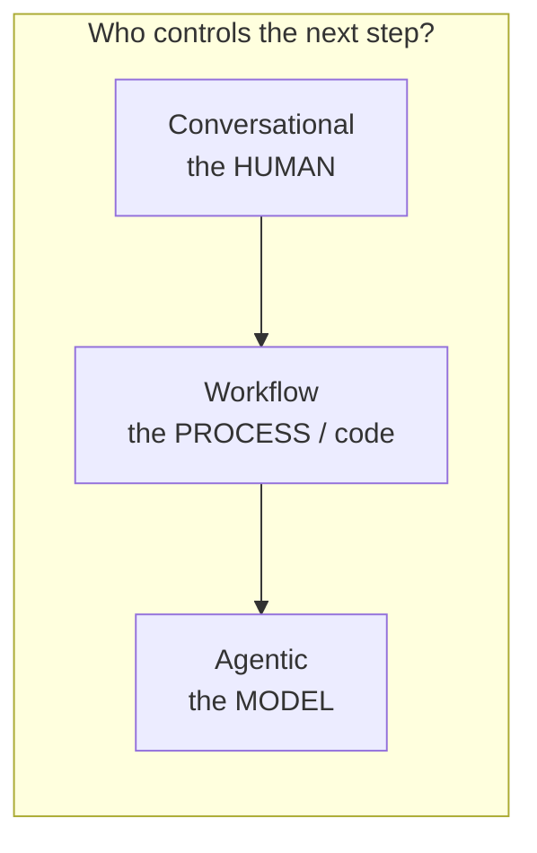
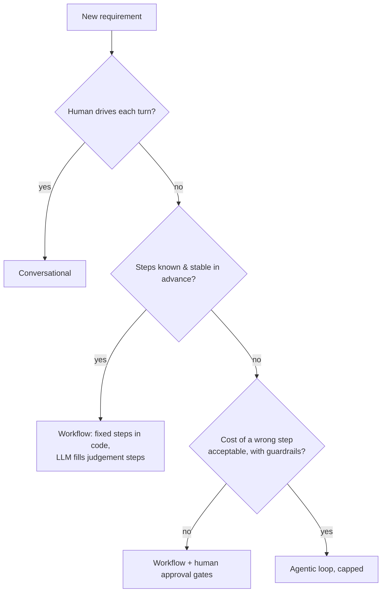
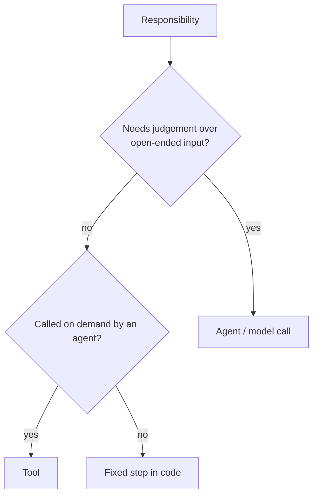
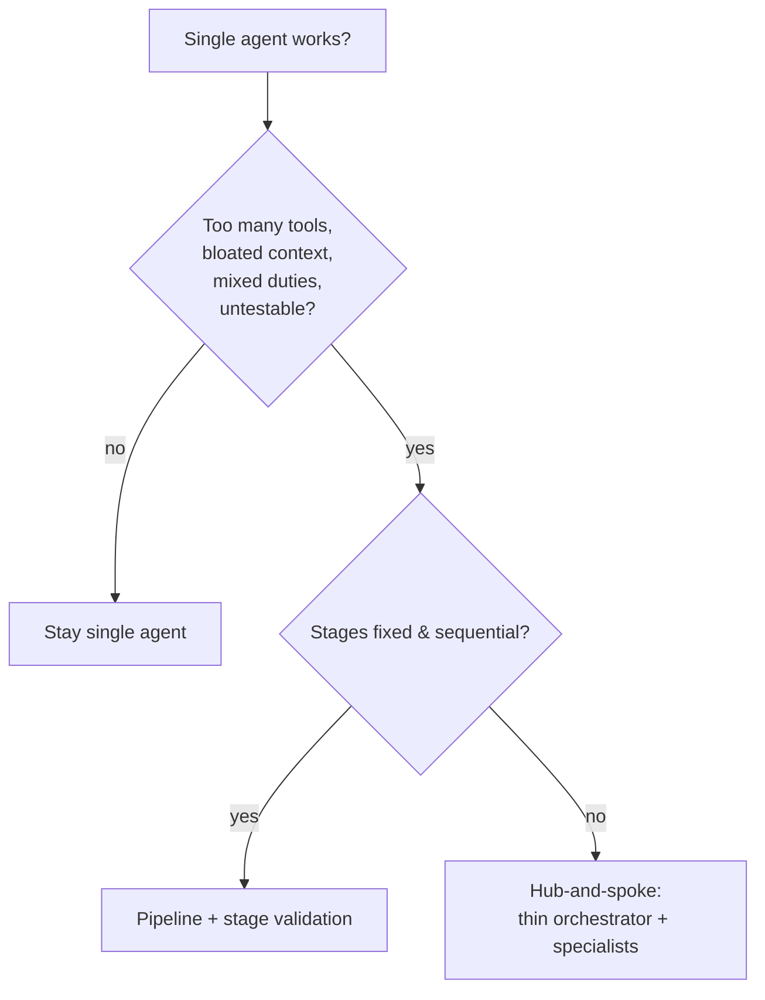
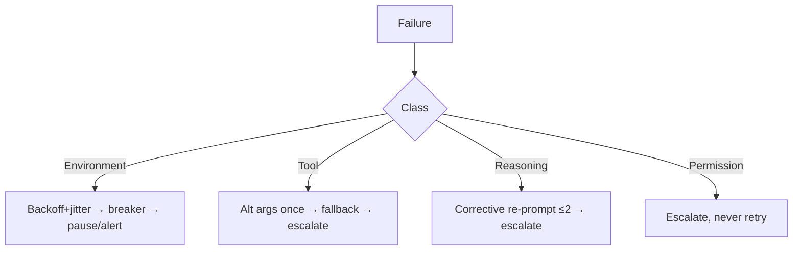
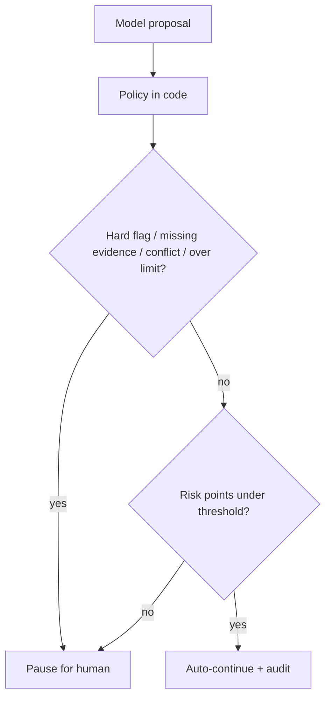
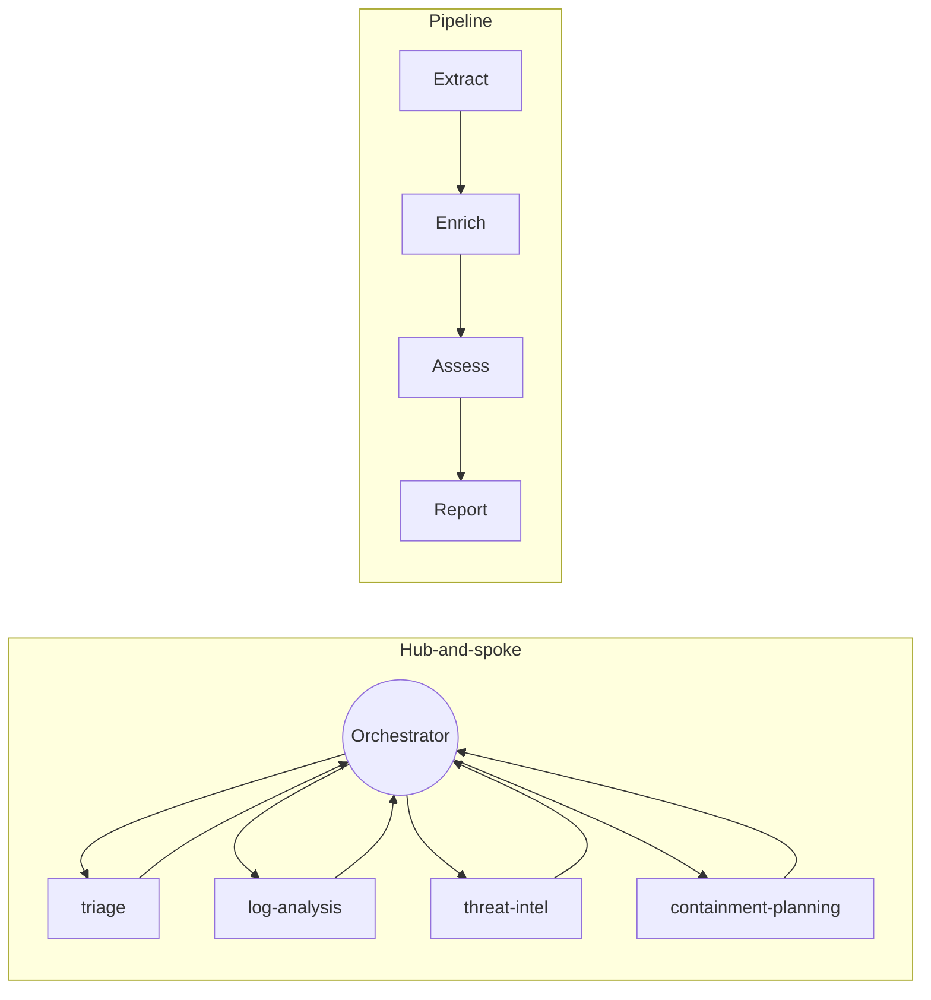

# Day 3 Study Guide — Agentic Architecture & Orchestration

**Exam domain:** Domain 1 (27% — the largest) · **Topics:** T11 Agentic loops & when to use them · T12 Task decomposition & planning · T13 Orchestrator-subagent design · T14 Multi-agent topologies · T15 Building & deploying agents
**Demos:** 3A Should This Even Be an Agent? · 3B Monolith → Multi-Agent (signature) · 3C Agent Failure Laboratory · 3D Human Escalation
**Labs:** 3.1 Product Recall: Choose & Decompose · 3.2 Cyber Incident Hub-and-Spoke (Build-It) · 3.3 Release Readiness Pipeline · 3.4 Data-Centre Maintenance Agent (Agent SDK hooks + approval)

> Offline runs use scripted stand-ins for the model. Haiku/Sonnet/Opus planner comparison for Demo 3B is a live result to be captured by the trainer — this guide quotes none.

---

## 1. What this day teaches

1. The **least powerful mechanism that works** wins: conversational < workflow < agentic.
2. Decompose a job into **Agent / Tool / Fixed Step** — only judgement belongs to an agent.
3. Multi-agent systems are about **context isolation, narrow tool sets and checkable handoffs**, not about "more agents".
4. Failures fall into **classes** (tool / reasoning / environment / permission); each needs a different recovery path.
5. Autonomy needs **deterministic guardrails** and **human escalation** enforced in code.

## 2. Mental model


An agent is **a loop**: model decides → tool acts → observation → model decides … until done or capped. Everything else (routing, validation, retries, citations numbering, arithmetic) should leave the loop and become code.

## 3. Core concepts

**Conversational vs workflow vs agentic.** The deciding signal is *who controls the next step*. Secondary signals: path predictability, reliability need, cost of error, latency budget. Agent cost grows because each turn re-sends history, and variance grows because paths differ between runs.

**When NOT to use an agent:** path is known; regulated/deterministic outcome needed; tight latency or cost; a rules engine already exists and only text→fields needs a model (Demo 3A's expense review: Haiku-class extraction + code policy check). "Agent told to follow a checklist" is just a workflow written in a worse language.

**Agent vs Tool vs Fixed Step**

| Component | Decides? | Deterministic? | Use for |
|---|---|---|---|
| **Fixed step** | No | Yes | Normalise dates, dedupe, number citations, enforce policy, retries |
| **Tool** | No (called by agent) | Yes | Query, calculate, fetch, act |
| **Agent** | Yes | No | Choose queries, read & judge sources, resolve conflicts, plan |

**Decomposition (T12).** List responsibilities → assign each to Agent/Tool/Step → define interfaces (typed inputs/outputs) → low coupling (no shared mutable state) → testable units → record an ADR (Lab 3.1). Plan before acting: a planner output should be a structured plan (steps, dependencies), validated before execution.

**Orchestrator–subagent / hub-and-spoke (T13/T14).** A **thin orchestrator** decides *who* does *what*; **specialist subagents** with isolated contexts and small tool sets do the work and return **structured handoffs**. All communication goes through the hub.

**Pipeline.** Fixed order of stages (Extract → Enrich → Assess → Report); each stage's output is **validated** before the next starts; failures are local.

**Context isolation.** Subagents get only the task and the data they need — not the full history. Leak test (Lab 3.2): private IOC data from one specialist must not appear in another's prompt.

**Structured handoffs.** Schema-validated objects `{status, result, evidence, confidence, errors}` — never free prose between agents. Validate at every boundary; an empty or malformed output must not flow downstream (Lab 3.3).

**Error classes (Demo 3C).**
| Class | Typical signal | Recovery |
|---|---|---|
| TOOL | typed error, other 4xx | One retry with alt args from the hint → fallback tool (degraded) → escalate |
| REASONING | validator violation, semantic error code | Corrective re-prompt (≤2), change approach → escalate |
| ENVIRONMENT | 5xx/408/429/timeout | Backoff + jitter, circuit breaker, pause + one alert, half-open probe |
| PERMISSION | 401/403 | **Do not retry**; escalate |
| UNKNOWN | default | Treat conservatively; escalate |

Classification order matters: a semantic 422 about *content* is REASONING, not a broken tool.

**Error propagation.** A failed subagent must be **reported** to the orchestrator and surfaced — never silently dropped (Lab 3.2 starter bug). The final answer states what is missing.

**Escalation (Demo 3D).** Decision = proposal (model) + **policy evaluated in code** (hard flags, risk points, conflicts, missing evidence) → auto-continue / escalate / reject. Self-reported model confidence is **miscalibrated** and is not a control. Human step: four-eyes (reviewer ≠ requester), authority limit ≥ amount, evidence digest unchanged, reason required, idempotent resume, audit trail.

**Deployment/hardening (T15).** Max steps/turns, token and budget caps, timeouts, circuit breakers, idempotency keys, structured logs/traces, policy versioning, least-privilege tools, kill switch. In Claude Agent SDK: **PreToolUse hooks** block/modify before execution, **PostToolUse hooks** audit; hooks are deterministic, prompts are not (Lab 3.4).

## 4. Architecture patterns & decision trees

**Tree 1 — Which architecture?**


**Tree 2 — Agent / Tool / Fixed Step for one responsibility**


**Tree 3 — Single agent or multi-agent?**


**Tree 4 — Failure response**


**Tree 5 — Auto-continue or human?**


## 5. Important API / CLI / SDK concepts

- Agent loop = Day 2 tool loop + stop conditions + budgets. Cap iterations (Demo 3A caps at 10).
- Claude Agent SDK (`claude-agent-sdk`): define tools, run with options, register **hooks** (`PreToolUse`, `PostToolUse`) that return allow/deny decisions or audit. Stage 5 of Demo 3D ports escalation to SDK hooks; Lab 3.4 builds PreToolUse guardrails + PostToolUse audit + approval pause/resume.
- Handoff validation with JSON Schema (`additionalProperties: false`); state persistence (SQLite, compare-and-set) for pause/resume.
- Offline run pattern: `python main.py` (or `python STARTER/main.py --mode offline`) then `python check_lab.py` from the lab folder — see each `LAB_GUIDE.md`.

## 6. Decision rules

1. Use the lowest rung of the ladder that is sufficient.
2. Move everything deterministic out of the loop.
3. Subagent = narrow job, narrow tools, narrow context, schema output.
4. Orchestrator stays thin: route, aggregate, report errors.
5. Validate every handoff; fail locally and loudly.
6. Classify before recovering; retry only environment (and capped tool/reasoning) failures.
7. Policy lives in code; the model proposes, code decides.
8. Escalate on: hard flags, high value, missing/conflicting evidence, permission problems, exhausted recovery.

## 7. Common mistakes

Everything-is-an-agent; sharing full history with every subagent; swallowing subagent failure; retry storm on reasoning/permission errors; relying on "confidence ≥ 0.9"; policy in the prompt ("never skip approval"); no iteration cap; shared mutable state between components; passing free text between agents.

## 8. Anti-patterns

Monolithic agent with 12 tools and a 4× repeated system prompt; blanket `for attempt in range(4)` wrapper; orchestrator that does the work itself; human approval without evidence digest (approving something that changed); escalation that auto-resumes on timeout; "agent + checklist prompt" instead of a workflow.

## 9. Production considerations

Budget and turn caps per run; per-dependency circuit breakers with shared state and half-open probes; jitter on backoff; idempotency on resume (case id + evidence digest); trace every delegation and handoff; alert on guardrail blocks and escalation rate; version policy files (record the hash in the audit trail); least-privilege tools; test with fault injection.

## 10. Model-selection guidance

| Role | Tier | Why |
|---|---|---|
| Orchestrator / most agents | Sonnet-class | Default for tool use and judgement |
| Mechanical specialists, classifiers, summaries of review packets, extraction | Haiku-class | Cheap, bounded tasks |
| Planner on hard decomposition | Opus-class **only if measured better** | Demo 3B planner comparison is trainer-led; capture live results |
| Control logic, policy, routing guarantees | **No model** | Code |

## 11. Cost implications

Agent loops re-send growing history each turn → cost ∝ turns² for naive loops, with variance between runs. A workflow with a Haiku extraction + code beats an agent on cost and variance when the path is known (Demo 3A measures three implementations — measure yours). Multi-agent adds orchestration overhead but cuts per-agent tool/context size; isolation reduces tokens per call. Retry storms multiply spend (Demo 3C: four identical doomed attempts = four paid calls).

## 12. Reliability implications

Determinism increases as you push logic into code. Stage validation localises failures. Circuit breakers prevent thundering herds. Error classes prevent wrong recoveries. Idempotent resume prevents double payments. Audit trails make decisions reconstructable. Hooks give guarantees prompts cannot.

## 13. Important commands / code patterns

```python
# Classify then decide (pure function, unit-testable) — pattern from Demo 3C
action = decide(error_class, attempt_state, recovery_policy)   # RETRY_BACKOFF | RETRY_ALT_ARGS | REPROMPT | FALLBACK | PAUSE | ESCALATE

# Handoff envelope between agents
handoff = {"agent": "log_analysis", "status": "ok|failed|partial",
           "result": {...}, "evidence": [...], "errors": [...]}
validate(handoff, HANDOFF_SCHEMA)        # reject empty/malformed before next stage
```
```bash
python check_lab.py   # Labs 3.1–3.4: design validator, leak test, fault-injection table, hook tests
```

## 14. Diagram — hub-and-spoke vs pipeline



## 15. Comparison tables

**Conversational vs workflow vs agentic**

| | Conversational | Workflow | Agentic |
|---|---|---|---|
| Controls next step | Human | Code | Model |
| Predictability | n/a | High | Low–medium |
| Cost/variance | Low | Low | Higher, variable |
| Best for | FAQ, Q&A | Expense review, nightly KPI digest | Competitive research, incident triage |

**Hub-and-spoke vs pipeline**

| | Hub-and-spoke | Pipeline |
|---|---|---|
| Order | Dynamic, orchestrator decides | Fixed |
| Parallelism | Possible among specialists | Stage by stage |
| Failure locality | Subagent; orchestrator handles | Stage; stop or degrade |
| Use | Investigations, varied subtasks | ETL-like release/report flows |
| Risk | Orchestrator bloat, hidden failures | Rigidity, empty data flowing on |

**Retry vs fallback vs escalation**

| | Retry | Fallback | Escalate |
|---|---|---|---|
| When | Transient environment | Primary unavailable, alternative fresh/valid | Cannot resolve safely |
| Bounded by | Count, backoff, breaker | Declared degraded mode | Human SLA |
| Never for | Permission, reasoning repeats | Silently hiding degradation | — |

## 16. Scenario questions

1. A nightly KPI digest has fixed steps and a fixed schedule. Which rung?
2. An orchestrator forwards the whole conversation to four specialists; a private indicator appears in the wrong report. Fix?
3. A subagent times out; the final report looks complete. What went wrong?
4. A tool returns 403. The harness retries 4×. Why wrong, and what instead?
5. A payment agent reports confidence 0.96 on a payment to a 34-day-old vendor with a bank mismatch. How should release be decided?
6. A pipeline's Enrich stage returns `[]` and Assess hallucinates. Fix?
7. Which responsibilities in market research stay agents?

**Answers:** (1) Workflow. (2) Context isolation: pass only the needed fields; add leak test. (3) Error propagation: failure was swallowed; the orchestrator must surface it. (4) Permission class → no retry; escalate. (5) Policy in code (hard flag BANK_MISMATCH) → human; confidence is not a control. (6) Validate each stage's output; fail locally. (7) Choosing queries, judging sources/conflicts, verification; arithmetic, dedupe, normalisation, citation numbering are tools/fixed steps.

## 17. Certification-oriented takeaways

- Domain 1 is 27% — expect many "which architecture / which component / what recovery" questions.
- Correct answers favour: simplest sufficient design, code-enforced policy, structured handoffs, isolated context, classified errors, bounded recovery, human-in-the-loop for high risk.
- Wrong answers: more agents by default, prompt-only guardrails, retry-everything, model self-confidence as a gate, passing full history.

## 18. If you remember only 10 things

1. Who controls the next step? decides the architecture.
2. Use the lowest sufficient rung.
3. Agent = judgement; Tool = capability; Fixed step = determinism.
4. Thin orchestrator, specialist subagents, isolated contexts.
5. Structured, validated handoffs.
6. Never swallow a subagent failure.
7. Classify errors: tool, reasoning, environment, permission.
8. Retry only what retries can fix; breakers for outages; never retry permission.
9. Policy in code; model confidence is not a control.
10. Cap loops, log everything, make resume idempotent.

---
*Source trail: `TRAINER/DAY_3/DEMOS/*/ARCHITECTURE.md` · `STUDENT/DAY_3/LABS/*` · `DAY3_VALIDATION_REPORT.md`.*
