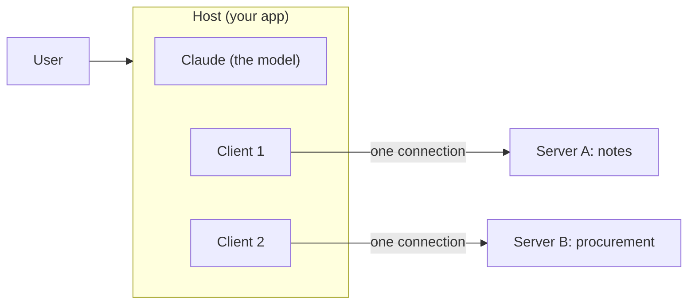
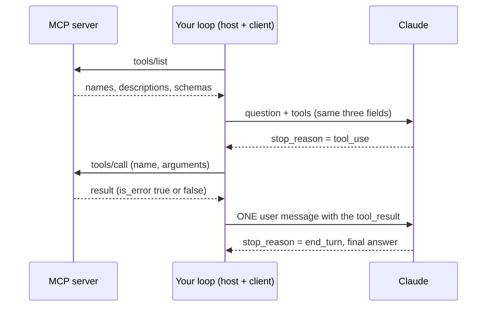
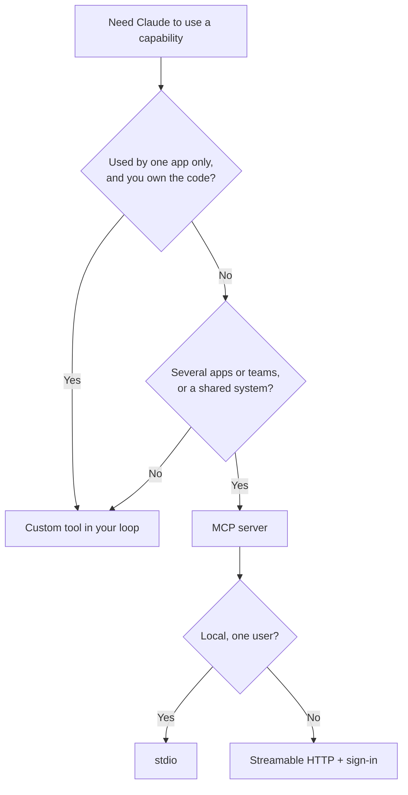

# Day 2 Study Guide: MCP Basics

**One standard plug for connecting Claude to your tools and data**

| | |
|---|---|
| **Reading time** | About 16 minutes |
| **You should already know** | The tool-use loop. Read [TOOL_USE_LOOP.md](TOOL_USE_LOOP.md) first. |
| **Class demos** | Intro to MCP · MCP server and client as separate apps · Demo 2D (MCP from zero to an enterprise-shaped service) |
| **Labs** | Lab 2.4 · Lab 2.6 (see the [map in section 10](#10-guide-to-demo-to-lab-map)) |
| **Next** | [MCP_SECURITY_AND_GOVERNANCE.md](MCP_SECURITY_AND_GOVERNANCE.md) |

---

## 1. The problem MCP solves

**Analogy: phone chargers before USB-C.** Every phone maker had its own plug. Every charger, car and laptop needed a different cable for every phone. With 5 phones and 4 chargers you needed up to 20 cables. A standard plug turns that into 5 + 4 = 9 things to build.

AI tools had the same mess. Say you have a customer database. A chatbot wants it. So does an IDE plugin, and so does a support agent. Without a standard, each app needs its own glue code and its own copy of the tool description. With **N** apps and **M** systems, that is up to **N x M** pieces of glue. When the system changes one function, every copy breaks.

**MCP** (Model Context Protocol) is an open standard for this. You build one **server** in front of your system. Any app that speaks MCP can use it. Now you need only N + M pieces.

The official introduction calls MCP "a USB-C port for AI applications".

**Where the analogy stops.** A cable only moves power and data. MCP also lets an app ask a server "what do you offer?" And a plug is not a lock: MCP makes connecting easy, but it does not decide who may connect (section 11).

## 2. Who is who: host, client and server

**Analogy: a hotel.** The **guest** is the person who wants something. The **concierge desk** is the app they talk to. Behind it, one **phone line** runs to each outside service (the taxi firm, the theatre). Each service picks up at its own end.

| MCP word | Simple meaning | Hotel version | In this course |
|---|---|---|---|
| **Host** | The AI application the user works in. It runs the model and decides what is allowed. | The concierge desk | Your Python script, Claude Desktop, Claude Code |
| **Client** | A piece inside the host that keeps **one** connection to **one** server. | One phone line | `ClientSession` in the demos and Lab 2.6 |
| **Server** | A program that offers tools and data to clients. | The taxi firm | `kitchen_server.py`, the procurement server, `notes_server.py` |

Claude never talks to a server. It reads tool descriptions and asks for calls. Your host does the talking.



**Where the analogy stops.** A phone line carries speech. An MCP connection carries structured messages (JSON-RPC). The demos print their method names: `initialize`, `tools/list` and `tools/call`.

## 3. What a server offers: tools, resources and prompts

**Analogy: a library.** The **librarian** can do things for you on request (look up a book, reserve it). The **shelves** hold things to read. The **forms at the desk** are ready-made templates that you choose and fill in yourself.

| Building block | Simple meaning | Library version | Who decides to use it | Course example |
|---|---|---|---|---|
| **Tool** | An action or a lookup, with inputs | The librarian does a task | **The model** picks it | `check_stock`, `get_po`, `search_notes` |
| **Resource** | Read-only data, found by an address (a URI) | A shelf you can browse | **The application** decides what to load | `menu://today`, `po://{po_id}` |
| **Prompt** | A reusable template, started on purpose | A form at the desk | **The user** picks it | The one prompt in Lab 2.4's server |

Two details worth knowing:

- A resource address with a placeholder, such as `po://{po_id}`, is a **template**. A client finds it with a separate "list templates" request, not in the plain resource list. Lab 2.4 shows this.
- "The model decides" does not mean "nobody checks". The official docs say tools are model-controlled, but MCP stresses human oversight. The host can ask the user before a risky call.

**Simple rule.** Does it change something, or need inputs to work out an answer? Make it a **tool**. Is it stable content to read? Make it a **resource**. Does a person start it from a menu? Make it a **prompt**.

**Where the analogy stops.** A server can offer any mix of the three, and most offer mostly tools. The Claude API's MCP connector (section 5) supports only tools.

## 4. A tiny server and how a client calls it

**Analogy: a vending machine.** You press a button, and the machine does one job. A short label tells you what each button does. The label is the tool description, and Claude chooses a button from the label alone.

```python
import sys
from mcp.server.mcpserver import MCPServer      # the SDK version the labs use (mcp 2.3.0)

mcp = MCPServer("library")
SHELVES = {"dune": "SF-12", "emma": "CL-03"}

@mcp.tool()                                      # the docstring becomes the tool description
def find_book(title: str) -> str:
    """Look up one book by title and return its shelf code. Use when someone asks where a book is. Read-only."""
    shelf = SHELVES.get(title.strip().lower())
    return f"{title}: shelf {shelf}" if shelf else f"No book called {title}."

if __name__ == "__main__":
    print("library server starting", file=sys.stderr)   # logs go to stderr, never stdout
    mcp.run(transport="stdio")                           # the client starts this program and talks to it
```

A client then does two things (this is the same handshake you will write in Lab 2.6): `await session.list_tools()` to see the menu, and `await session.call_tool("find_book", {"title": "Dune"})` to order.

**What to notice**

1. You wrote no schema. The SDK builds the name, the description and the input schema from the function. The type hint `title: str` becomes a required string input.
2. The server runs no model. It is plain code.
3. The `print` goes to `sys.stderr`. Section 7 explains why this matters.
4. The labs use this same import. Older tutorials show `FastMCP`, which was renamed in `mcp` 2.x, so old snippets will not run.

**What you should see.** `list_tools()` returns one tool: `find_book`, with your docstring and a schema that asks for a string called `title`. `call_tool` returns one text item: `Dune: shelf SF-12`. The result also says whether it is an error (`is_error` is false here).

## 5. How a server's tools reach Claude

This is the key section. Claude does not know MCP exists. It only knows the tool-use format from [TOOL_USE_LOOP.md](TOOL_USE_LOOP.md): a `name`, a `description` and an `input_schema`.

**Analogy: a translator at a restaurant.** The kitchen (the MCP server) writes its menu in its own format. Your host copies each dish onto the diner's menu card (Claude's tool definitions). When the diner orders, the host walks the ticket back to the kitchen and brings back the dish. The diner never meets the kitchen.

The steps:

1. The client connects and says hello (`initialize`).
2. The client asks `tools/list`. The server answers with names, descriptions and schemas.
3. **Your loop copies those three fields into the `tools` list** of a normal Messages API request. Lab 2.6 does this in a small function. It copies only `name`, `description` and `input_schema`, because the API rejects unknown fields.
4. Claude replies with `stop_reason: "tool_use"` and a ticket (`tool_use` block).
5. **Your loop forwards the ticket to the server** with `tools/call`. This replaces the "run my own Python function" line of the old loop.
6. The server's answer goes back to Claude as a `tool_result`, with the same id. If the server marked it an error, you set `is_error: true`.
7. The loop repeats until Claude says `end_turn`.



Every rule from the tool-use guide still applies: one `tool_result` per ticket, same id, all results of one turn in one message, and a turn limit. **MCP changes where the tool lives. The loop stays the same.**

Your loop sits in the middle, so it is where you can say no. Lab 2.6 adds an **allow-list**: only approved tools are shown to Claude, and any other requested tool is refused. A newer server may add a tool you never reviewed. A description is only advice, and your client does the enforcing.

**A shortcut for remote servers.** The Claude API has an **MCP connector**. You give the Messages API the address of a remote server, and Anthropic's side talks to it, so you write no client. Know its limits from the docs: it supports only tool calls (not resources or prompts), and the server must be reachable over HTTP from the internet. A local stdio server cannot be used. In this course you build the client yourself so you can see the loop.

**Where the analogy stops.** Your loop understands nothing. It copies fields, so Claude's choices are only as good as the server's descriptions.

## 6. Transports: how the messages travel

A **transport** is the road the messages drive on. MCP defines two standard ones.

**Analogy: a conversation at your desk versus a phone call.** At your desk, you and a colleague share a room and nobody else can listen. A phone call can reach anyone, anywhere, so you must first check who is calling.

| | **stdio** | **Streamable HTTP** |
|---|---|---|
| **How it works** | The client starts the server as a child program and talks through its standard input and output | The server runs by itself at a URL. Each message is an HTTP POST. |
| **Desk or phone** | Desk | Phone |
| **Where the server runs** | The same machine | Anywhere you can reach |
| **Who can connect** | Only the program that started it | Any allowed client |
| **Good for** | Local tools, one person, desktop apps | Shared or company servers |
| **Course examples** | Intro to MCP demo, Lab 2.6, Lab 2.4 stages 1 to 5 | Separate server and client demo (port 8000), Lab 2.4 stage 6 |

**The old SSE transport.** Early MCP used a transport called HTTP+SSE (SSE means Server-Sent Events, a way for a server to keep pushing messages). The official spec says Streamable HTTP replaced it in version 2025-03-26. The current spec marks HTTP+SSE as deprecated: new implementations should not adopt it, existing ones should move to Streamable HTTP, and it may be removed in a future revision. The Claude Code docs say the same about SSE servers. Lab 2.4's config linter flags `type: sse` for this reason.

The transport is configuration. In Lab 2.4 stage 6, one client script gets identical answers over stdio and over HTTP.

**Where the analogy stops.** A desk conversation is not automatically safe, and a phone call can be made safe. Section 11 points to the sign-in topic.

## 7. The stdio rule: stdout belongs to the protocol

**Analogy: a single telephone wire between two rooms.** Only the agreed conversation goes down the wire. If someone shouts their own comments into it, the listener hears noise and cannot follow.

On stdio, the server's **standard output** (stdout, where `print` writes) is the wire. Every line on it must be a valid MCP message. The spec says the server must not write anything else there. It may write logs to **standard error** (stderr), and the client does not read those as messages.

So: **never `print()` to stdout in a stdio server. Log to stderr.**

What failure looks like:

| What happened | What you see |
|---|---|
| A banner or debug `print` on stdout | The client cannot read the line. It may log a parse error, or the first request may time out. Demo 2D and Lab 2.4 stage 1 show `initialize FAILED (TimeoutError)`. |
| The same server with `print(..., file=sys.stderr)` or the `logging` module | It connects at once. |

To fix it, run the server alone and read its stderr. Search the code for `print(`. Then send logs to stderr. Lab 2.4 does this with `logging.basicConfig(stream=sys.stderr, ...)`.

Some SDK versions skip unreadable lines. Do not rely on that.

**Where the analogy stops.** The rule is only for stdio. An HTTP server's console is not the wire.

## 8. When something fails

**Analogy: a restaurant that tells you why.** "That dish is sold out" lets you pick again. A silent kitchen leaves you waiting. Three kinds of failure matter here.

| Failure | Looks like | What to do |
|---|---|---|
| **The tool failed** (unknown id, out of stock) | The server returns a result with `is_error` set, and the session stays alive | Send it to Claude as a `tool_result` with `is_error: true`. Claude can retry with new inputs or tell the user. |
| **The server is not reachable** (stopped, wrong address) | Your connect step raises an exception | Catch it. Tell the user in plain words and say how to start the server. The separate server and client demo does this. Never let it crash with a stack trace. |
| **The server broke the wire** (stdout corruption) | Time-out or parse errors on connect | See section 7. |

Two rules to remember.

1. **A tool error is data, not a crash.** In the SDK, an exception raised inside a tool becomes a result with `is_error` true. Be careful: in `mcp` 2.3.0 the original message is hidden from the client (it sees a generic "Error executing tool ..."). So return the reason yourself when you want Claude to read it. The demos and Lab 2.4 do it like this:

```python
from mcp.types import CallToolResult, TextContent

def not_found(title):      # return this from a tool when the lookup fails
    return CallToolResult(is_error=True, content=[TextContent(type="text", text=f"No book called {title}.")])
```

2. **Wrap the forwarding call.** In Lab 2.6, `session.call_tool` sits in a `try`. If the call itself raises (the server went away), Claude gets an error result and the loop goes on. Every ticket must still get its answer.

Sign-in failures on HTTP servers (401 or 403) arrive in the 2.3.0 client as a generic error, not a status code. Lab 2.4 stage 6 shows this.

## 9. Custom tool or MCP server?

**Analogy: a kitchen knife or a food-truck.** If you only cook at home, keep a knife in your drawer. If many restaurants need the same dish, a food-truck that serves them all is worth the trouble.

| Your situation | Pick | Why |
|---|---|---|
| One app, one team, logic you own | **Custom tool** | Simplest and fastest. No extra process. |
| Several apps need the same capability (chatbot, IDE, agent) | **MCP server** | Write once, use everywhere. This is N + M. |
| A system you do not own, shared by many | **MCP server** | One place for access control and logs |
| Fast prototype, or a pure function you unit-test | **Custom tool** | Move to MCP later if you need to |
| Hot path where every millisecond counts | **Custom tool** | No extra hop |
| Needs its own process and its own credentials | **MCP server** | Better isolation |
| Read-only documents to browse | **MCP resources** | A fit for the resource type |



**Where the analogy stops.** MCP is not "better". It adds a process and more to secure. Start with a custom tool, and move to MCP when a second consumer appears.

## 10. Guide to demo to lab map

These pairings were checked against the current course files. Two of the demos are also in your own `LABS` folder (see the note below the table).

| Idea | Section | Class demo | Lab | What you do |
|---|---|---|---|---|
| The N x M problem | 1 | **Intro to MCP**, stage 1 (a pizza kitchen with three apps, all broken by one change) | [Intro to MCP](../../DAY_2/LABS/DEMO_2_0_intro_to_mcp/README.md) (run it yourself, no key) | Watch three apps break, then survive the same change with MCP |
| Client and server are separate programs | 2, 4, 6 | **MCP server and client as separate apps** | [Separate server and client](../../DAY_2/LABS/DEMO_2_0_mcp_separate_server_and_client/README.md) (run it yourself, no key) | Run a server in one terminal and a client in another, then stop the server and read the friendly error |
| Tools, resources, prompts, validation | 3, 4, 8 | **Demo 2D**: MCP from zero to an enterprise-shaped service, stages 2 and 3 | **Lab 2.4**: [Build and Lock Down a Procurement MCP Server](../../DAY_2/LABS/LAB_2_4_procurement_mcp_server/README.md) | TODO 2 adds a `po://{po_id}` resource. TODO 3 adds the validated `get_po` tool. |
| The stdout rule | 7 | Intro to MCP, stage 4. Demo 2D, stage 1. | Lab 2.4, TODO 1 | Fix a server that hangs by logging to stderr |
| Transports | 6 | Demo 2D, stage 6 | Lab 2.4, TODO 4 (config linter, flags `sse`) and stage 6 (same server over HTTP) | Compare stdio and HTTP with the same client |
| Tools reach Claude through your loop | 5 | Demo 2D, stage 4 (your own client and a host loop) | **Lab 2.6**: [Use an MCP Server from Your Own Agent](../../DAY_2/LABS/LAB_2_6_use_an_mcp_server/README.md) | Six edits (about 25 lines): connect, convert the tools, forward calls, guard, allow-list |
| The loop you already know | 5 | Demo 2B | [Lab 2.5](../../DAY_2/LABS/LAB_2_5_build_a_tool_and_loop/README.md) (optional) | Build the loop first, then Lab 2.6 swaps your functions for an MCP server |

**Why do demo folders sit in the labs folder?** The class demos live in the trainer's folder, which you do not receive. The two short intro demos are key-free and quick, so copies were placed in your `DAY_2/LABS` folder (the files are the same as the trainer's). Run them before Lab 2.4 or 2.6. Demo 2D is shown by your instructor. Lab 2.4 repeats its stages, so you do the same steps yourself.

Demo 2D has stages 0 to 6, and Lab 2.4 has stages 1 to 6. They line up from stage 1.

**Suggested route.** Read this guide, run the two intro demos, do Lab 2.4, then Lab 2.6. Lab 2.6 is optional and needs an API key. Lab 2.4 needs none.

## 11. Security: one pointer

**Analogy: a shared socket in a busy office.** A port that anything can plug into is very handy, and just as easy to misuse. Someone has to decide who may plug in, and what each plug may do.

Easy to reach can also mean easy to misuse. Who may connect, who may call which tool, and how keys are kept are covered in [MCP_SECURITY_AND_GOVERNANCE.md](MCP_SECURITY_AND_GOVERNANCE.md). Read it next.

## 12. Claude Code and MCP, in one short pointer

**Analogy: the same charger working on a second laptop.** A server you built once plugs into another host without changes, because both sides speak the same protocol.

Claude Code is an MCP **host**. You add a server with `claude mcp add --transport http <name> <url>` (remote) or `claude mcp add --transport stdio <name> -- <command>` (local). Day 4 covers this.

## 13. Knowledge check

1. Three apps each need the same CRM lookup. What problem do you have without MCP, and how does MCP change the count?
2. Name the three kinds of things a server offers. For each, say who decides to use it.
3. Your loop receives a `tool_use` for a tool that lives on an MCP server. Which call does your code make, and what goes back to Claude?
4. A stdio server connects fine in the editor but times out in the demo after you added a `print("starting")`. What is wrong and how do you fix it?
5. Your team has one agent, one developer, and a function that formats dates. Custom tool or MCP server? What would change your answer?
6. A server update adds `delete_note`. Your client lists tools and passes them all to Claude. What went wrong, and what is the fix?

**Answers**

1. Each app needs its own glue and copy of the description, so N apps and M systems need up to N x M pieces, and one change breaks all of them. With MCP you write one server per system and one client per app, so N + M.
2. Tools (the model decides), resources (the application decides), prompts (the user decides).
3. `session.call_tool(name, arguments)`. The text of the result goes back as a `tool_result` with the same id, with `is_error` set if the server said so.
4. The print writes to stdout, which carries the protocol. Log to stderr instead.
5. A custom tool: one app, code you own. A second consumer, such as an IDE or another team's agent, would move it toward MCP.
6. Nobody reviewed the new tool, and the client trusted the server. Keep an allow-list, and show Claude only approved tools. Refuse any other requested tool.

## 14. Key takeaways

1. MCP is one standard plug. It turns N x M pieces of glue into N + M.
2. Host runs the model, client holds one connection, server offers the capabilities.
3. Servers offer tools (model decides), resources (application decides) and prompts (user decides).
4. Claude never sees MCP. Your loop lists the server's tools, passes `name`, `description` and `input_schema`, and forwards each ticket. The loop is the same as before.
5. Use stdio for a local server, and Streamable HTTP for a shared one. The old SSE transport is deprecated. On stdio, stdout belongs to the protocol, so log to stderr.
6. Use a custom tool for one app and code you own. Use MCP when several consumers need the same capability. Start simple.

## Further reading

- [MCP Best Practices](../../STUDY_GUIDE/MCP_BEST_PRACTICES.md): designing good tools, results and context cost
- [MCP Security Architecture](../../STUDY_GUIDE/MCP_SECURITY_ARCHITECTURE.md): threats, layers and authorization in depth
- [Study guide index](../../STUDY_GUIDE/README.md)

## Official references

- [MCP introduction](https://modelcontextprotocol.io/docs/getting-started/intro)
- [MCP architecture overview](https://modelcontextprotocol.io/docs/learn/architecture)
- [MCP server concepts](https://modelcontextprotocol.io/docs/learn/server-concepts)
- [MCP specification: transports](https://modelcontextprotocol.io/specification/latest/basic/transports)
- [MCP specification: stdio](https://modelcontextprotocol.io/specification/latest/basic/transports/stdio)
- [MCP specification: Streamable HTTP](https://modelcontextprotocol.io/specification/latest/basic/transports/streamable-http)
- [Claude API: MCP connector](https://platform.claude.com/docs/en/agents-and-tools/mcp-connector)
- [Claude Code: connect to tools via MCP](https://code.claude.com/docs/en/mcp)
