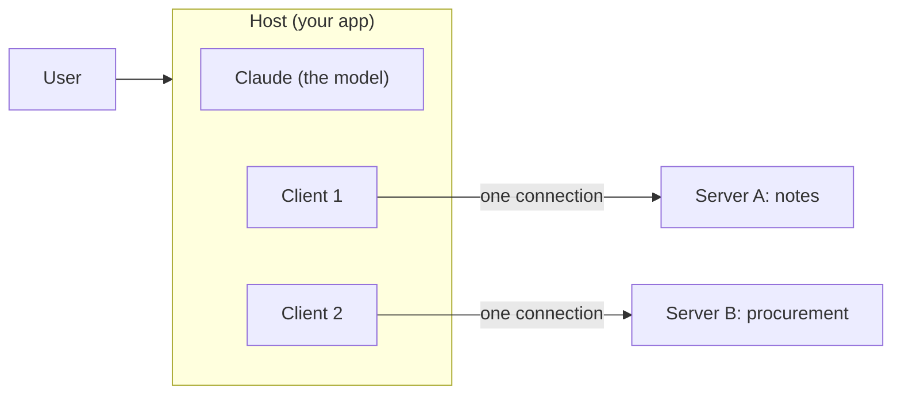

# Day 2 Study Guide: MCP Basics

**One standard plug for connecting Claude to your tools and data**

| | |
|---|---|
| **Reading time** | About 16 minutes |
| **You should already know** | The tool-use loop. Read [TOOL_USE_LOOP.md](TOOL_USE_LOOP.md) first. |
| **Class demos** | Intro to MCP · MCP server and client as separate apps · Demo 2D (MCP from zero to an enterprise-shaped service) |
| **Labs** | Lab 2.4 · Lab 2.6 (see the [map in section 10](#10-guide-to-demo-to-lab-map)) |
| **Next** | [MCP_SECURITY_AND_GOVERNANCE.md](MCP_SECURITY_AND_GOVERNANCE.md) |

---

## 1. The problem MCP solves

**Analogy: phone chargers before USB-C.** Every phone maker had its own plug. With 5 phones and 4 chargers you needed up to 20 cables. A standard plug turns that into 5 + 4 = 9 things to build.

AI tools had the same mess. A chatbot, an IDE plugin and a support agent may all want the same customer database. Without a standard, each app needs its own glue code and tool description. With **N** apps and **M** systems, that is up to **N x M** pieces of glue. When the system changes one function, every copy breaks.

**MCP** (Model Context Protocol) is an open standard for this. You build one **server** in front of your system. Any app that speaks MCP can use it. Now you need only N + M pieces.

**Where the analogy stops.** A plug is not a lock: MCP makes connecting easy, but it does not decide who may connect (section 11).

## 2. Who is who: host, client and server

**Analogy: a hotel.** The **guest** is the person who wants something. The **concierge desk** is the app they talk to. Behind it, one **phone line** runs to each outside service (the taxi firm, the theatre). 

| MCP word | Simple meaning | Hotel version | In this course |
|---|---|---|---|
| **Host** | The AI application the user works in. It runs the model and decides what is allowed. | The concierge desk | Your Python script, Claude Desktop, Claude Code |
| **Client** | A piece inside the host that keeps **one** connection to **one** server. | One phone line | `ClientSession` in the demos and Lab 2.6 |
| **Server** | A program that offers tools and data to clients. | The taxi firm | `kitchen_server.py`, the procurement server, `notes_server.py` |

Claude never talks to a server. It asks for calls, and your host does the talking, in JSON-RPC messages. The demos print method names: `initialize`, `tools/list` and `tools/call`.



## 3. What a server offers: tools, resources and prompts

**Analogy: a library.** The **librarian** can do things for you on request (look up a book, reserve it). The **shelves** hold things to read. The **forms at the desk** are ready-made templates that you choose and fill in yourself.

| Building block | Simple meaning | Library version | Who decides to use it | Course example |
|---|---|---|---|---|
| **Tool** | An action or a lookup, with inputs | The librarian does a task | **The model** picks it | `check_stock`, `get_po`, `search_notes` |
| **Resource** | Read-only data, found by an address (a URI) | A shelf you can browse | **The application** decides what to load | `menu://today`, `po://{po_id}` |
| **Prompt** | A reusable template, started on purpose | A form at the desk | **The user** picks it | The one prompt in Lab 2.4's server |

A resource address with a placeholder, such as `po://{po_id}`, is a **template**. A client finds it with a separate "list templates" request. "The model decides" does not mean "nobody checks": the host can ask the user before a risky call.

**Simple rule.** An action or a lookup with inputs is a **tool**. Stable content to read is a **resource**. Something a person starts from a menu is a **prompt**. Most servers offer mostly tools. The Claude API's MCP connector (section 5) supports only tools.

## 4. A tiny server and how a client calls it

**Analogy: a vending machine.** You press a button, and the machine does one job. A short label tells you what each button does. The label is the tool description, and Claude chooses a button from the label alone.

```python
import sys
from mcp.server.mcpserver import MCPServer      # the SDK version the labs use (mcp 2.3.0)

mcp = MCPServer("library")
SHELVES = {"dune": "SF-12", "emma": "CL-03"}

@mcp.tool()                                      # the docstring becomes the tool description
def find_book(title: str) -> str:
    """Look up one book by title and return its shelf code. Use when someone asks where a book is. Read-only."""
    shelf = SHELVES.get(title.strip().lower())
    return f"{title}: shelf {shelf}" if shelf else f"No book called {title}."

if __name__ == "__main__":
    print("library server starting", file=sys.stderr)   # logs go to stderr, never stdout
    mcp.run(transport="stdio")                           # the client starts this program and talks to it
```

A client (as in Lab 2.6) does two things: `await session.list_tools()` to see the menu, and `await session.call_tool("find_book", {"title": "Dune"})` to order.

**What to notice.** You wrote no schema: the SDK builds the name, description and input schema from the function, and `title: str` becomes a required string input. The server runs no model. The `print` goes to `sys.stderr` (section 7 explains why). Older tutorials show `FastMCP`, which was renamed in `mcp` 2.x, so old snippets will not run.

**What you should see.** `list_tools()` returns one tool, `find_book`. `call_tool` returns one text item, `Dune: shelf SF-12`, with `is_error` false.

## 5. How a server's tools reach Claude

This is the key section. Claude does not know MCP exists. It only knows the tool-use format from [TOOL_USE_LOOP.md](TOOL_USE_LOOP.md).

**Analogy: a translator at a restaurant.** The kitchen (the MCP server) writes its menu in its own format. Your host copies each dish onto the diner's menu card (Claude's tool definitions). When the diner orders, the host walks the ticket back to the kitchen and brings back the dish. The diner never meets the kitchen.

1. The client connects and says hello (`initialize`).
2. The client asks `tools/list`. The server answers with names, descriptions and schemas.
3. **Your loop copies those three fields into the `tools` list** of a normal Messages API request. Lab 2.6 does this in a small function. It copies only those fields, because the API rejects unknown ones.
4. Claude replies with `stop_reason: "tool_use"` and a ticket (`tool_use` block).
5. **Your loop forwards the ticket to the server** with `tools/call`. (This replaces "run my own Python function".)
6. The server's answer goes back to Claude as a `tool_result`, with the same id. If the server marked it an error, you set `is_error: true`.
7. The loop repeats until Claude says `end_turn`.

Every rule from the tool-use guide still applies (one `tool_result` per ticket, same id, one message per turn, a turn limit). **MCP changes where the tool lives. The loop stays the same.**

Your loop is where you can say no. Lab 2.6 adds an **allow-list**: only approved tools are shown to Claude, and any other requested tool is refused. A newer server may add a tool you never reviewed, and your client does the enforcing. Your loop copies fields and understands nothing, so Claude's choices are only as good as the server's descriptions.

**A shortcut for remote servers.** The Claude API has an **MCP connector**. You give the Messages API the address of a remote server, and Anthropic's side talks to it, so you write no client. It supports only tool calls (not resources or prompts), and the server must be reachable over HTTP from the internet. A local stdio server cannot be used. In this course you build the client yourself.

## 6. Transports: how the messages travel

A **transport** is the road the messages drive on. MCP defines two standard ones.

**Analogy: a desk conversation versus a phone call.** At your desk, only the person in the room can listen. A phone call can reach anyone, so you must first check who is calling.

| | **stdio** | **Streamable HTTP** |
|---|---|---|
| **How it works** | The client starts the server as a child program and talks through its standard input and output | The server runs by itself at a URL. Each message is an HTTP POST. |
| **Where the server runs** | The same machine | Anywhere you can reach |
| **Who can connect** | Only the program that started it | Any allowed client |
| **Good for** | Local tools, one person | Shared or company servers |
| **Course examples** | Intro to MCP demo, Lab 2.6, Lab 2.4 stages 1 to 5 | Separate server and client demo (port 8000), Lab 2.4 stage 6 |

**The old SSE transport.** Early MCP used HTTP+SSE (Server-Sent Events). The spec says Streamable HTTP replaced it in version 2025-03-26, and HTTP+SSE is now deprecated. Lab 2.4's config linter flags `type: sse` for this reason.

The transport is configuration: in Lab 2.4 stage 6, one client script gets identical answers over stdio and HTTP. Neither is safe by itself. Section 11 points to the sign-in topic.

## 7. The stdio rule: stdout belongs to the protocol

**Analogy: a single telephone wire between two rooms.** Only the agreed conversation goes down the wire. Stray shouting makes noise the listener cannot follow.

On stdio, the server's **standard output** (stdout, where `print` writes) is the wire. Every line on it must be a valid MCP message. The spec says the server must write nothing else there. Logs go to **standard error** (stderr), which the client does not read as messages.

So: **never `print()` to stdout in a stdio server. Log to stderr.**

| What happened | What you see |
|---|---|
| A banner or debug `print` on stdout | The client cannot read the line. It may log a parse error, or the first request may time out. Demo 2D and Lab 2.4 stage 1 show `initialize FAILED (TimeoutError)`. |
| The same server with `print(..., file=sys.stderr)` or the `logging` module | It connects at once. |

To fix it, search the code for `print(` and send logs to stderr, as Lab 2.4 does with `logging.basicConfig(stream=sys.stderr, ...)`. Some SDK versions skip unreadable lines. Do not rely on that. The rule is only for stdio.

## 8. When something fails

**Analogy: a restaurant that tells you why.** "That dish is sold out" lets you pick again. A silent kitchen leaves you waiting.

| Failure | Looks like | What to do |
|---|---|---|
| **The tool failed** (unknown id, out of stock) | The server returns a result with `is_error` set, and the session stays alive | Send it to Claude as a `tool_result` with `is_error: true`. Claude can retry or tell the user. |
| **The server is not reachable** (stopped, wrong address) | Your connect step raises an exception | Catch it and tell the user in plain words how to start the server. No stack trace. |
| **The server broke the wire** (stdout corruption) | Time-out or parse errors on connect | See section 7. |

Two rules to remember.

1. **A tool error is data, not a crash.** In the SDK, an exception raised inside a tool becomes a result with `is_error` true. But in `mcp` 2.3.0 the original message is hidden (the client sees a generic "Error executing tool ..."). So return the reason yourself, as a `CallToolResult(is_error=True, content=[TextContent(type="text", text=...)])` from `mcp.types`. The demos and Lab 2.4 do this.
2. **Wrap the forwarding call.** In Lab 2.6, `session.call_tool` sits in a `try`. If it raises, Claude gets an error result and the loop goes on. Every ticket must still get its answer.

In the 2.3.0 client, sign-in failures on HTTP servers (401 or 403) arrive as a generic error, not a status code.

## 9. Custom tool or MCP server?

**Analogy: a kitchen knife or a food-truck.** For home cooking, keep a knife in your drawer. If many restaurants need the same dish, a food-truck is worth the trouble.

| Your situation | Pick | Why |
|---|---|---|
| One app, one team, logic you own | **Custom tool** | Simplest and fastest. No extra process. |
| Several apps need the same capability (chatbot, IDE, agent) | **MCP server** | Write once, use everywhere. This is N + M. |
| A system you do not own, shared by many | **MCP server** | One place for access control and logs |
| Fast prototype, or a pure function you unit-test | **Custom tool** | Move to MCP later if you need to |
| Needs its own process and its own credentials | **MCP server** | Better isolation |

MCP is not "better". It adds a process and more to secure. Start with a custom tool, and move to MCP when a second consumer appears. Local server for one user: stdio. Shared server: Streamable HTTP with sign-in.

## 9A. Configuring and connecting servers

**Analogy: saving a contact in your phone.** You save the name and number once, and the phone dials for you. Connecting a server is the same: you write down its name, where it lives and how to prove who you are.

- **Your own client (this course).** You write the connect code, as in Lab 2.6.
- **The Claude API MCP connector.** In the request you add a `mcp_servers` list. Each entry has a `type` (only `"url"`), a `url` (it must start with `https://`), a unique `name`, and an optional `authorization_token`. You also add one **toolset** per server in the `tools` list, to allow-list or deny-list its tools. The docs show a beta header for the connector, and a newer one that pins the server's tool list so it cannot change mid-conversation. Check the connector page for the current header name.
- **Claude Code.** You add a server with `claude mcp add`. A scope flag says who gets it: `local` (only you, this project), `project` (shared through a `.mcp.json` file) or `user` (you, all projects). The `/mcp` panel shows each server's state. A server from a project's `.mcp.json` waits for your approval before it connects. Day 4 covers this.

## 9B. Credentials and vaults

**Analogy: hotel key cards.** Each guest gets a card that opens only their own room, and the hotel can cancel it. Nobody hands out the master key.

Many servers want proof of who is calling. Three facts:

- **The connector passes a token. It does not sign you in.** You get an OAuth access token yourself, then put it in the server's `authorization_token` field.
- **Keep the token out of code and prompts.** Read it from an environment variable or a secrets manager. In a shared Claude Code `.mcp.json`, write `${VAR}` and let each person supply the value.
- **A vault is a store of credentials for one end user.** In Claude Managed Agents (the hosted agent service), you create a vault, add credentials, and pass it to a session. When the agent connects to a server whose URL matches a stored credential, the token is added for it. Values you put in are write-only. Expired OAuth tokens are refreshed. A plain Messages API call has no vaults, so there you manage tokens yourself.

Check the Managed Agents vault page for current details. Rotation, least privilege and log hygiene are in [MCP_SECURITY_AND_GOVERNANCE.md](MCP_SECURITY_AND_GOVERNANCE.md).

## 9C. Synchronous or batch?

**Analogy: a restaurant counter versus a laundry drop-off.** At the counter you wait. At the laundry you leave a big bag and collect it later, at a lower price per item.

- **Synchronous** (the normal Messages API): you send a request and wait. Use it when a person is waiting or each step needs the last result.
- **Batch** (the Message Batches API): you submit many requests together. They run asynchronously, most finish within an hour, and you can collect results when the batch ends or after 24 hours. It costs 50 percent less. Use it for large volumes where nobody is waiting.

The batch page lists **MCP connectors** among the server-side tools that work in batch requests. If a request returns `pause_turn`, send the paused reply back in a follow-up request.

Three cautions (a design view, so check the docs for exact rules).

1. A loop that needs **your own** tool between steps cannot finish in one request: Claude stops with `tool_use`, you run the tool, and you send a new request.
2. Your own stdio MCP client is not a connector request, so you batch only the Messages calls around it.
3. A batch can run for hours. The credential and server must still work later, and the server must handle bursts of calls.

## 10. Guide to demo to lab map

| Idea | Section | Class demo | Lab | What you do |
|---|---|---|---|---|
| The N x M problem | 1 | **Intro to MCP**, stage 1 | [Intro to MCP](../../DAY_2/LABS/DEMO_2_0_intro_to_mcp/README.md) (run it yourself, no key) | Watch three apps break, then survive the same change with MCP |
| Client and server are separate programs | 2, 4, 6 | **MCP server and client as separate apps** | [Separate server and client](../../DAY_2/LABS/DEMO_2_0_mcp_separate_server_and_client/README.md) (run it yourself, no key) | Run server and client in two terminals, then stop the server and read the friendly error |
| Tools, resources, prompts, validation | 3, 4, 8 | **Demo 2D**: MCP from zero to an enterprise-shaped service, stages 2 and 3 | **Lab 2.4**: [Build and Lock Down a Procurement MCP Server](../../DAY_2/LABS/LAB_2_4_procurement_mcp_server/README.md) | TODO 2 adds a `po://{po_id}` resource. TODO 3 adds the validated `get_po` tool. |
| The stdout rule | 7 | Intro to MCP, stage 4. Demo 2D, stage 1. | Lab 2.4, TODO 1 | Fix a server that hangs by logging to stderr |
| Transports | 6 | Demo 2D, stage 6 | Lab 2.4, TODO 4 (config linter, flags `sse`) and stage 6 (same server over HTTP) | Compare stdio and HTTP with the same client |
| Tools reach Claude through your loop | 5 | Demo 2D, stage 4 (your own client and a host loop) | **Lab 2.6**: [Use an MCP Server from Your Own Agent](../../DAY_2/LABS/LAB_2_6_use_an_mcp_server/README.md) | Six edits (about 25 lines): connect, convert the tools, forward calls, guard, allow-list |
| The loop you already know | 5 | Demo 2B | [Lab 2.5](../../DAY_2/LABS/LAB_2_5_build_a_tool_and_loop/README.md) (optional) | Build the loop first, then Lab 2.6 swaps your functions for an MCP server |

The two short intro demos are key-free, so copies sit in your `DAY_2/LABS` folder. Run them before Lab 2.4 or 2.6. Your instructor shows Demo 2D, and Lab 2.4 repeats its stages (Demo 2D has stages 0 to 6, Lab 2.4 has 1 to 6, lined up from stage 1).

**Suggested route.** Read this guide, run the two intro demos, do Lab 2.4, then Lab 2.6. Lab 2.4 needs no key. Lab 2.6 is optional and needs one.

## 11. Security: one pointer

**Analogy: a shared socket in a busy office.** Anything can plug in, so someone must decide who may, and what each plug may do.

Read [MCP_SECURITY_AND_GOVERNANCE.md](MCP_SECURITY_AND_GOVERNANCE.md) next.

## 12. Claude Code and MCP, in one short pointer

**Analogy: the same charger working on a second laptop.** A server you built once plugs into another host unchanged.

Claude Code is an MCP **host**. You add a server with `claude mcp add --transport http <name> <url>` (remote) or `claude mcp add --transport stdio <name> -- <command>` (local). Day 4 covers this.

## 13. Knowledge check

1. Three apps each need the same CRM lookup. What problem do you have without MCP, and how does MCP change the count?
2. Name the three kinds of things a server offers. For each, say who decides to use it.
3. Your loop receives a `tool_use` for a tool that lives on an MCP server. Which call does your code make, and what goes back to Claude?
4. A stdio server connects fine in the editor but times out in the demo after you added a `print("starting")`. What is wrong and how do you fix it?
5. A server update adds `delete_note`, and your client passes every listed tool to Claude. What went wrong, and what is the fix?
6. You use the MCP connector with a server that needs sign-in. Where does the token go, who obtains it, and where should it be stored?
7. You must run an MCP-backed summary over 50,000 documents overnight. Synchronous or batch, and what two things do you check first?

**Answers**

1. Each app needs its own glue: up to N x M pieces, and one change breaks all. With MCP, one server per system and one client per app: N + M.
2. Tools (the model decides), resources (the application decides), prompts (the user decides).
3. `session.call_tool(name, arguments)`. The text of the result goes back as a `tool_result` with the same id, with `is_error` set if the server said so.
4. The print writes to stdout, which carries the protocol. Log to stderr instead.
5. Nobody reviewed the new tool, and the client trusted the server. Keep an allow-list, show Claude only approved tools, and refuse any other requested tool.
6. In the `authorization_token` field of that server's `mcp_servers` entry. You obtain the OAuth token yourself. Store it in an environment variable or a secrets manager, never in code or a prompt.
7. Batch: nobody is waiting and it costs less. First check how connector tools behave in a batch, and that the server and its credential will last and can take the call volume.

## 14. Key takeaways

1. MCP is one standard plug. It turns N x M pieces of glue into N + M.
2. Host runs the model, client holds one connection, server offers the capabilities.
3. Servers offer tools (model decides), resources (application decides) and prompts (user decides).
4. Claude never sees MCP. Your loop lists the server's tools, passes three fields, and forwards each ticket. The loop is the same.
5. Use stdio for a local server and Streamable HTTP for a shared one. SSE is deprecated. On stdio, log to stderr.
6. Use a custom tool for one app and code you own. Use MCP when several consumers need the same capability. Start simple.

## Further reading

- [MCP Best Practices](../../STUDY_GUIDE/MCP_BEST_PRACTICES.md): designing good tools, results and context cost
- [MCP Security Architecture](../../STUDY_GUIDE/MCP_SECURITY_ARCHITECTURE.md): threats, layers and authorization in depth
- [Study guide index](../../STUDY_GUIDE/README.md)

## Official references

- [MCP introduction](https://modelcontextprotocol.io/docs/getting-started/intro)
- [MCP architecture overview](https://modelcontextprotocol.io/docs/learn/architecture)
- [MCP server concepts](https://modelcontextprotocol.io/docs/learn/server-concepts)
- [MCP specification: transports](https://modelcontextprotocol.io/specification/latest/basic/transports)
- [MCP specification: stdio](https://modelcontextprotocol.io/specification/latest/basic/transports/stdio)
- [MCP specification: Streamable HTTP](https://modelcontextprotocol.io/specification/latest/basic/transports/streamable-http)
- [Claude API: MCP connector](https://platform.claude.com/docs/en/agents-and-tools/mcp-connector)
- [Claude Code: connect to tools via MCP](https://code.claude.com/docs/en/mcp)
- [Message Batches API](https://platform.claude.com/docs/en/build-with-claude/batch-processing)
- [Managed Agents: vaults](https://platform.claude.com/docs/en/managed-agents/vaults)
