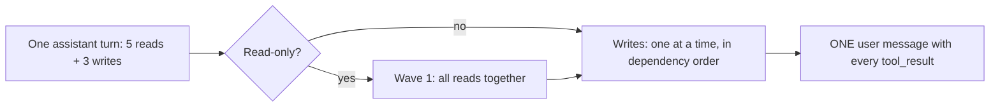

# Day 2 Study Guide: Parallel Tool Calls and Ordering

**Which calls may run together, and which must wait for each other**

| | |
|---|---|
| **Reading time** | About 15 minutes |
| **You should already know** | The tool-use loop and the four `tool_result` rules. Read [`TOOL_USE_LOOP.md`](TOOL_USE_LOOP.md) first. |
| **Class demo** | Demo 2C (parallel calls without a double charge) |
| **Lab** | Lab 2.2 (see the [map in section 9](#9-guide-to-demo-to-lab-map)) |
| **Related guide** | [`TOOL_ERRORS_AND_RETRIES.md`](TOOL_ERRORS_AND_RETRIES.md) for the full story on failures and retries |

---

## 1. What parallel tool calls are

A diner can order several dishes at once. In tool use, this is a **parallel tool call**: Claude puts **several `tool_use` blocks in one assistant turn**.

**Analogy: a diner who orders the starter, main and drink in one go.** The waiter walks three tickets to the kitchen together.

The docs say Claude 4 and later models call tools in parallel by default when it helps.

**Two parties make two different choices:**

| Who | Decides |
|---|---|
| **Claude** | How many tickets go in one turn |
| **Your code** | Whether the kitchen cooks them at the same time, one after another, or in a planned order |

Claude sees tool names and descriptions, not your backend. It does not know the card machine only works after the stock is reserved. So the safe order is **your** job.

**Where the analogy stops.** Claude may list tickets in any order, even backwards. The order on the ticket is not the right order to cook.

## 2. Reads and writes: the one split that matters

**Analogy: window shopping versus buying.** Ten people can look at one window at once. Two people cannot both buy the last jacket.

| | Read (look) | Write (buy) |
|---|---|---|
| **What it does** | Only fetches information | Changes something in the world |
| **Examples** | `crm_profile`, `order_history`, `flight_status` | `reserve_stock`, `charge_card`, `book_hotel` |
| **Safe to repeat?** | Yes | No. Repeating may do the thing twice. |
| **Safe to overlap?** | Usually yes | Not unless they are fully independent |

A **side effect** is any change a tool leaves behind: money moved, a seat booked, an email sent. A tool with none is **read-only**.

Writes may need each other:

- `charge_card` needs `reserve_stock` to have worked. Do not charge for stock that is not held.
- `send_confirmation` needs `charge_card` to have worked. Do not say "paid" before they paid.

These links are **dependencies**. They live in your business, not in the tool schema. Nothing in the JSON tells Claude (or a thread pool) that they exist.

**Exam habit.** Ask two questions about every call. "Does it change anything?" "Does it need another call's result or effect first?" If both answers are no, it can run with the others.

## 3. Why run reads together: time = the slowest, not the sum

**Analogy: four cooks, four dishes.** One cook making all four takes the total time. Four cooks at once take as long as the slowest dish.

Four lookups take 1, 2, 2 and 3 seconds.

One after another: 1 + 2 + 2 + 3 = **8 seconds**. All at once: the slowest, **3 seconds**.

In Demo 2C, the order desk has five reads. Running them at once means the customer waits for the slowest, not all five.

Two limits:

- Parallel calls save **time**, not tokens.
- The gain only exists when Claude puts the reads in the same turn. If it asks one per turn, there is nothing to overlap. The docs suggest asking for independent lookups together. A newer model may batch less in long agent loops, so check your traces.

## 4. Why writes at once are dangerous

**Analogy: three people editing one bank account at the same moment.** Together, the result depends on who finishes first.

When your code runs a turn's writes on a thread pool, these can go wrong. All are in Demo 2C.

| Problem | What happens | Everyday picture |
|---|---|---|
| **Race** | The calls finish in whatever order they happen to finish. | The fastest wins, even if it should be last. |
| **Charge before reserve** | The charge goes through, then the reserve fails. Money taken, no goods. | Paying for a seat that does not exist. |
| **Confirmation before charge** | The customer is told "paid", then the card is declined. | A receipt for a payment that never happened. |
| **Double charge** | The same charge runs twice (see section 8). | Swiping the card twice. |

A **race** means the outcome depends on timing nobody controls. It may pass a test and fail on a busy day. A model that happens to order writes correctly is luck, not a guarantee. That is why Demo 2C replays a recorded batch when the live model behaves.



## 5. Run a turn's calls together, and still answer in the right shape

Running calls together changes how you **cook**, not how you **serve**. The four rules from the loop guide still hold:

1. All results of the turn go in **one** user message, right after Claude's message.
2. One `tool_result` per `tool_use`, with a matching `tool_use_id`.
3. `tool_result` blocks come first. Any text comes after.
4. Nothing sits between Claude's message and your results.

**Analogy: a tray with matching ticket numbers.** The cooks finish in any order. The waiter puts every dish on **one** tray and delivers it once.

Two practical points:

- **Order of results.** The API matches by `tool_use_id`, but the safe habit is the same order as the `tool_use` blocks. A thread pool's `map` does this. Collecting results as they finish does not.
- **Every ticket gets an answer.** If you refuse or skip a call, still send a `tool_result` with `is_error: true`. A missing result gives an HTTP 400.

**Why not split results across messages?** Three results in three user messages can make the API reject the history (the loop guide's rule 3). The docs add a second cost: even when accepted, the wrong shape "teaches" Claude to stop making parallel calls later. The docs call this the most common reason parallel calls stop appearing.

## 6. Your first parallel executor

**Analogy: four cooks and one tray.** The code starts all the cooks, waits for all, and builds one tray in ticket order. A **thread pool** is a small team of workers that run functions at the same time. The tool is a stub that sleeps one second, so the speed-up is easy to see.

```python
import json
import time
from concurrent.futures import ThreadPoolExecutor

def look_up(name, args):                       # stub for a real read-only tool
    time.sleep(1)                              # pretend each lookup takes 1 second
    return {"tool": name, "ok": True}

def run_turn_in_parallel(blocks):
    """blocks: the tool_use blocks of ONE assistant turn, all read-only."""
    with ThreadPoolExecutor(max_workers=8) as pool:
        outputs = list(pool.map(lambda b: look_up(b["name"], b["input"]), blocks))   # same order as blocks
    results = [{"type": "tool_result", "tool_use_id": b["id"], "content": json.dumps(o)}
               for b, o in zip(blocks, outputs)]
    return {"role": "user", "content": results}   # ALL results, ONE message

turn = [{"type": "tool_use", "id": f"toolu_0{i}", "name": n, "input": {"customer_id": "C-1001"}}
        for i, n in enumerate(["crm_profile", "order_history", "billing_status"], 1)]
start = time.time()
message = run_turn_in_parallel(turn)
print([r["tool_use_id"] for r in message["content"]], f"{time.time() - start:.1f}s")
```

**What to notice**

1. `pool.map` runs the calls at the same time but returns outputs **in the order of the calls**.
2. Each result copies its ticket's id into `tool_use_id`. One list, one message.
3. This executor is only right for reads. It does not know which call must wait for which.

**Expected output** (three calls of one second each finish in about one second)

```
['toolu_01', 'toolu_02', 'toolu_03'] 1.0s
```

In real code, wrap each call so a crash becomes an `is_error: true` result (loop guide, section 8).

## 7. Keep dependent writes in order

**Analogy: a checkout line with a gatekeeper.** One customer at a time. Before each enters, the gatekeeper asks: "Do you have your ticket from the previous step?"

The rule: **reads together, writes one at a time in the right order.** Your code needs three things.

**a) Prerequisites.** A table that you write, such as "`charge_card` needs `reserve_stock`" and "`send_confirmation` needs `charge_card`". Demo 2C stores a read-only flag and the prerequisites next to each tool. An unlabelled tool is treated as a write. When unsure, go slowly.

**b) Waves.** Your code groups the turn's calls into **waves**. Consecutive reads form one wave and run together. Each write gets its own wave. A wave starts only when the one before has finished. Results still go back in Claude's ticket order.

**c) A gate before each write.** A small check that runs just before the write. It asks:

- Have all the prerequisites **succeeded**? If not, refuse with an error result and a hint.
- Does every reference in the arguments (a `rebook_ref`, a `hotel_ref`) really come from a tool result? If not, **refuse it**. Claude can make up a reference that looks real.

**Analogy: a cheque.** You do not hand over goods because someone *says* they have a cheque. You check the bank issued it.

A refusal is information. Send it back as a `tool_result` with `is_error: true` and a hint such as "call the missing tool first". Claude can then act correctly next turn.

**Gate or reorder?** In Demo 2C, the hardened executor **reorders** the writes itself, so a backwards batch still works. In Lab 2.2, the gate **refuses** a write whose prerequisite has not succeeded, and the model gets the error. Both are valid: the code, not Claude's ticket order, decides.

**The unfinished-chain rule.** If the first write fails (for example, out of stock), later writes must not run. Demo 2C shows this: three `tool_use` blocks, three results, no money moved.

## 8. Retries, timeouts and the idempotency key

**Analogy: a card machine that freezes after taking your money.** If you swipe again, you may pay twice.

A **timeout** on a write means "outcome unknown". The booking may be done, though you never heard back. Demo 2C and Lab 2.2 both show this: the rebooking is committed, but the reply is lost.

An **idempotency key** is a receipt number for a request. If the same request arrives again with the same number, the system returns the first result and does nothing new.

Rules of thumb:

1. **Your code builds the key, not Claude.** Demo 2C and Lab 2.2 hash the tool name and the arguments, with keys sorted. The same call always gives the same key.
2. **The key goes to the service.** It is not in the model's tool schema.
3. **Tell Claude the truth about a timeout.** The Lab 2.2 result says the outcome is unknown and a retry with identical arguments is safe, because of the key.
4. **You need both ordering and keys.** The demo's ablation shows it: serializing the writes fixes the order but not the double charge, and keys fix the double charge but not the order.
5. **Watch what goes into the key.** If two orders are truly different, something in the arguments (such as an order id) must differ, or the second is treated as a repeat.

Claude can also emit the same write twice in one turn. Two identical writes must never run at the same instant. With a key, the second returns the first result.

For the full retry rules, read [`TOOL_ERRORS_AND_RETRIES.md`](TOOL_ERRORS_AND_RETRIES.md).

## 9. Guide to demo to lab map

| Idea | Section | Class demo | Lab | What you do in the lab |
|---|---|---|---|---|
| Overlap reads, break it with writes, fix it | 3 to 8 | **Demo 2C**: Parallel Tool Calls Without a Double Charge (order desk) | **Lab 2.2**: Run the Tool Calls of One Turn Safely ([README](../../DAY_2/LABS/LAB_2_2_travel_disruption_tool_loop/README.md)) | Five edits in `lab.py`, about 40 lines |

**Demo 2C, stage by stage**

| Stage | What you watch | Idea |
|---|---|---|
| 1 | Five lookups run one by one, with parallel allowed and with `disable_parallel_tool_use` | Claude decides the batch, your code the overlap |
| 2 | The thread pool cuts the tool phase to the slowest call. Three broken result messages are rejected with HTTP 400. | Sections 3 and 5 |
| 3 | Three dependent writes race, and a timeout plus retry charges twice. Then a diagnosis and an ablation. | Sections 4 and 8 |
| 4 | The hardened executor: prerequisites, waves, preconditions, keys | Section 7 |
| Final | Two live checkouts, then the certification question | Section 10 |

**Lab 2.2, edit by edit** (an airline disruption assistant: four reads, then rebook, hotel and notify)

| Edit | You write | Idea |
|---|---|---|
| TODO 1 | The `loyalty_tier` tool definition | A read-only tool with a clear description |
| TODO 2 | `run_concurrently` on a thread pool | Section 6 |
| TODO 3 | `gate` (prerequisites and unknown references) | Section 7 |
| TODO 4 | `key_for` and `timeout_result` | Section 8 |
| TODO 5 | A `for` loop with `max_turns` | Section 11 |

Judge each run by what was really booked (the ledger), not by what Claude says.

## 10. The exam question: "Which calls may run together?"

**Analogy: several cooks in one kitchen.** Two cooks can chop side by side. Nobody can plate a dish before it is cooked, and nobody should fry the same order twice.

This appears in Demo 2C and in certification style questions. Use the two questions from section 2. Claude returns one turn. Which set may run at the same time?

| Set | Calls | Verdict |
|---|---|---|
| A | `reserve_stock`, `charge_card`, `send_confirmation` for one order | No. They depend on each other. |
| B | `crm_profile`, `billing_status`, `shipment_tracking`, `order_history` for one customer | **Yes.** All independent reads. |
| C | `billing_status` and `charge_card` for the same customer | No. The write changes what the read shows. Read, then write. |
| D | `charge_card` for the same order, emitted twice | No. This is the classic double charge. Collapse them with a key and run one at a time. |

The answer is B. The three traps: **a hidden dependency, a mixed read and write, and a repeated write**.

## 11. Turning parallel calls off, and a turn limit

**`disable_parallel_tool_use`.** This option tells Claude not to put more than one tool call in a turn. Where it goes matters:

- It is set **inside the `tool_choice` object**, not at the top level of the request: `tool_choice={"type": "auto", "disable_parallel_tool_use": True}`.
- With `type: "auto"` (the default), Claude calls **at most one** tool per reply. It can still answer in plain text.
- With `type: "any"` or `"tool"`, it means exactly one tool. But the docs say that Claude Opus 5.5, Sonnet 5.5, Fable 5.1 and Mythos 5.1 do not support those two types. For those models, use `auto`.

**Analogy: a waiter who takes one order at a time.** Calmer, but more trips.

It is **not a safety fix.** It lowers the chance of a batch and costs extra round trips. It does not protect you from a repeated write, a retry or a made-up reference. The harness is the guarantee.

**A turn limit.** Claude may keep asking for tools forever. The API will not stop this. Put the loop in a `for` with a maximum (`range(1, max_turns + 1)`), and at the limit return a result that says why it stopped (`stopped: "max_turns"`), so the caller can tell a cut-off from a finished answer. Lab 2.2 stage 5 cuts a runaway model off at 8 turns.

## 11A. Programmatic tool calling: let Claude write a short script

**Analogy: a manager who writes a checklist instead of phoning you twenty times.** "Check all twenty branches, and only tell me the ones over budget."

Normally each tool call is a round trip through the model, and every raw result lands in Claude's context. With **programmatic tool calling**, Claude instead writes a short Python script. The script runs in the **code execution** tool, which is a sandbox (a sealed container) at Anthropic. The script calls your tools like functions, in a loop if needed, and filters the results. Claude sees only the final output.

How it works, in steps:

1. You include the code execution tool in your `tools` list.
2. On each of your own tools that may be called from code, you add `allowed_callers` with the code execution tool's name. The default is `["direct"]`, which is normal calling. A list can allow both ways. Check the docs page for the exact tool version string.
3. Claude writes the script. When the script reaches one of your tools, the sandbox pauses and the API sends you an ordinary `tool_use` block. Its `caller` field says the call came from code execution.
4. You run the tool and send back the `tool_result`, passing the `container` id from the paused reply. The script continues. The in-between results do not enter Claude's context.
5. When the script finishes, Claude gets the final output.

**Benefits.** Fewer round trips, fewer tokens, and room for loops and "stop when found" logic.

**Limits to know (from the docs).**

- It needs a code execution tool version and a model that support it. Check the docs.
- The message with your results may hold **only** `tool_result` blocks, with no text.
- `strict: true` tools, forcing a call with `tool_choice`, and `disable_parallel_tool_use` are not supported with it.
- Tools from an MCP connector, and the computer use and browser use tools, cannot be called this way.
- If your result takes about four minutes, the pending call times out inside the script.

Your safety rules stay. Each call still reaches your code as a `tool_use`, so your gates and idempotency keys still apply. Do not let a script batch many writes without them.

The two server tools it builds on, **web search and code execution**, are explained in [`TOOL_DESIGN.md`](TOOL_DESIGN.md) (section 6).

## 11B. Give each agent its own small toolbox

**Analogy: one huge toolbox or three small ones.** A plumber with 15 kinds of tool in one box wastes time hunting. Three specialists with five tools each reach for the right one at once.

Claude picks a tool by reading names and descriptions. A long list means more look-alikes, and picks get worse. The tool design guide notes that the docs say selection accuracy degrades past roughly 30 to 50 tools. Even at 15, overlapping tools get mixed up.

One fix is to **distribute the tools across specialist agents**. Say a support assistant has 15 tools: 5 for orders, 5 for billing, 5 for shipping.

- A **router** (or coordinator) reads the request and hands it to the right specialist.
- Each specialist sees only its own 5 tools, so each choice is easier.
- A specialist cannot misuse a tool it does not have. This is least privilege.

This costs extra calls and hand-offs, and the router can still choose wrongly. So fix descriptions first, merge overlapping tools, and split only when a list stays long or needs different permissions. [`../DAY_3/MULTI_AGENT_DESIGN.md`](../DAY_3/MULTI_AGENT_DESIGN.md) covers specialists, the coordinator and hand-offs in full.

## 12. Knowledge check

1. Claude returns `get_customer`, `get_orders` and `get_tickets` in one turn, all read-only. How should your code run them, and answer?
2. Claude returns `reserve_stock`, `charge_card` and `send_confirmation` in one turn. A teammate wants to run them on a thread pool "to be fast". What can go wrong?
3. `book_hotel` arrives with `rebook_ref: "RB-9999"`, but no tool ever returned that reference. What should your code do?
4. `rebook_flight` times out. The code retries it with the same arguments. The traveler now has two seats. What was missing?
5. Where does `disable_parallel_tool_use` go, and what does it do with `tool_choice` set to `auto`? Does it make writes safe?
6. Your code sends the three results of a turn as three user messages. Name two things that can go wrong.
7. Claude must check 40 branches and report only the ones over budget. Why might programmatic tool calling beat 40 normal tool calls, and name one limit?

**Answers**

1. Run them together, for example on a thread pool. Return one user message with three `tool_result` blocks, in ticket order.
2. A race: the confirmation may finish before the charge, or the charge may go through when the reserve fails. Run writes one at a time in dependency order, with a gate before each.
3. Refuse it. Send back a `tool_result` with `is_error: true` and a hint to use only references that a tool returned. Do not run the write.
4. An idempotency key built by your code. With it, the retry would return the first booking and add nothing.
5. It goes inside the `tool_choice` object. With `auto`, Claude calls at most one tool per reply. It does not make writes safe. It only reduces batching, and it costs round trips.
6. The API can reject the history with HTTP 400, and even if accepted, the wrong shape can teach Claude to stop making parallel calls. All results must go in one user message.
7. One script makes all 40 calls and filters the results, so there is one trip through the model and Claude sees only the short list. Limits: it needs the code execution tool, and MCP connector tools cannot be called this way.

## 13. Key takeaways

1. Claude decides how many calls go in one turn. Your code decides whether they overlap.
2. Independent reads can run together. The time is the slowest call, not the sum.
3. Writes that depend on each other run one at a time, in an order your code defines, with a gate before each.
4. Refuse any reference that no tool returned. Return an error result with a hint.
5. However you cook, serve once: all results in one user message, in ticket order, one per ticket.
6. A retried write needs an idempotency key from your code. `disable_parallel_tool_use` and a turn limit help, but neither replaces the gate and the key.

## 14. Official references

- [Parallel tool use](https://platform.claude.com/docs/en/agents-and-tools/tool-use/parallel-tool-use)
- [Programmatic tool calling](https://platform.claude.com/docs/en/agents-and-tools/tool-use/programmatic-tool-calling)
- [Handle tool calls](https://platform.claude.com/docs/en/agents-and-tools/tool-use/handle-tool-calls)
- [Troubleshooting tool use](https://platform.claude.com/docs/en/agents-and-tools/tool-use/troubleshooting-tool-use)
- [Define tools: forcing tool use](https://platform.claude.com/docs/en/agents-and-tools/tool-use/define-tools#forcing-tool-use)
