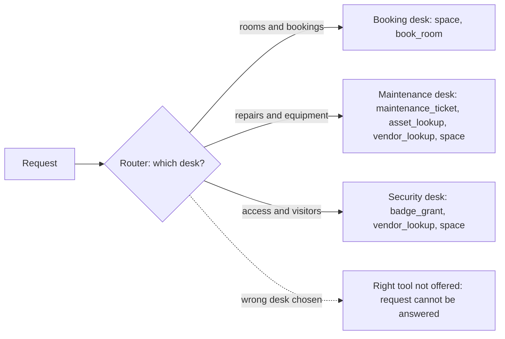

# Day 2 Study Guide: Tool Design and Selection

**How to build tools Claude picks correctly, and how to prove it**

| | |
|---|---|
| **Reading time** | About 15 minutes |
| **You should already know** | The restaurant picture and the tool-use loop. Read [`TOOL_USE_LOOP.md`](TOOL_USE_LOOP.md) first. |
| **Class demo** | Demo 2A (Bad Tool Architecture to Good Tool Architecture) |
| **Lab** | Lab 2.1 (Fix the Tool Boundaries of the Facilities Assistant). See the [map in section 9](#9-guide-to-demo-to-lab-map). |

---

## 1. Why tool design is the real lever

**Analogy: a restaurant menu.** Picture a menu with three dishes called "Chicken", "Chicken dish" and "Chicken special", each described as "tasty". The diner will guess. The menu is bad, not the cook.

In [`TOOL_USE_LOOP.md`](TOOL_USE_LOOP.md), the diner is Claude and the menu is your tool definitions. Claude cannot see your code. It sees only the menu. So when Claude picks the wrong tool, the menu is the first suspect and the model is the last.

## 2. What a tool definition contains

**Analogy: a menu entry.** It has a dish name, a description, a list of choices ("how would you like it cooked?"), and sometimes a photo.

| Field | Menu version | What it does |
|---|---|---|
| `name` | The dish name | Letters, numbers, `_` and `-`, up to 128 characters. |
| `description` | The text under the dish | Tells Claude what the tool does, when to use it, when not to, and its limits. |
| `input_schema` | The choices the diner must make | A JSON Schema that lists each input, its type, and which are required. |
| `input_examples` | The photo | Optional. A list of sample inputs that show a correct call. |
| `strict` | "The kitchen will refuse a badly filled ticket" | Optional. `true` forces every call to match your schema. |

Two fields need more words.

**`input_examples`.** Each example must be valid against your `input_schema`. If one is not, the API answers with HTTP 400. Examples cost tokens: roughly 20 to 50 for a simple one and 100 to 200 for a nested one. They work on your own tools, not on server tools. Use them for nested, optional or format-sensitive inputs. Descriptions matter most.

**`strict`.** With `strict: true`, Claude's sampling is constrained so the input always matches your schema. Types are right (`2`, not `"2"`). Required fields are present. The tool name is always one you offered. Notes:

- `strict` is a top-level field next to `name` and `description`, not inside `input_schema`.
- Strict mode supports only a subset of JSON Schema. For example, a `pattern` with a lookaround or backreference is rejected.
- On Opus 5.5, Sonnet 5.5, Fable 5.1 and Mythos 5.1, you cannot force a tool with `tool_choice` (it gives HTTP 400). So the pairing is `auto` plus `strict`: Claude chooses freely, and whatever it chooses is well-formed.

A strict kitchen guarantees the ticket is *filled in correctly*, not that the diner chose the *right dish*. Choosing is a description and boundary problem.

**Three description habits beyond the pilot:** name the sibling ("Do NOT use for X, use `other_tool`"); say what a misleadingly named tool really does (a `ticket_open` that actually *lists* tickets); and say what the tool does not return. Ask parameters for a short explanation, never for step-by-step reasoning, which the docs warn can trigger a refusal.

## 3. Boundary rules: where one tool ends and the next begins

**Analogy: doors in a building.** Every door has one clear sign. Two doors that both say "Entrance" make people stand and wonder.

| Rule | In plain words | Why |
|---|---|---|
| **One verb on one noun** | `refund_order` does one job on one thing. | Easy to describe and to test. |
| **No overlap** | No request should fit two tools equally well. | `get_customer`, `lookup_customer` and `find_account` is the classic case. |
| **Split reads from writes** | Looking and changing are different tools. | You can allow reads freely and gate writes. A "lookup" must never change anything. |
| **Consolidate by enum** | One tool with an `action` input when operations are the same kind on different keys. | Claude makes one decision, not four. The docs give `create_pr`, `review_pr`, `merge_pr` folded into one tool with an `action` input. |
| **Remove duplicates** | Delete the old tools after you add the new one. | Every tool you keep is a candidate for every request. |

**When not to consolidate.** Merge operations of the same kind and risk. Keep tools apart when they touch different systems or carry different risk. In Demo 2A, refunds and store credits stay apart because credits need a manager's approval. In Lab 2.1, `book_room` stays outside `space` because it alone commits a booking.

**Consolidation has a price.** The mistake can hide inside the `action` value, so your eval must check the action too (Demo 2A stage 3 prints it as `args(by)`).

**Name by area.** The docs recommend prefixing names with the service or area, such as `github_list_prs` and `slack_send_message`. It keeps picks clear as the list grows, and helps tool search (section 7).

**Adding without removing makes things worse.** In Lab 2.1 the model briefly sees 13 tools (11 old, 2 new) and they compete.

## 4. Why selection fails, and how to measure it

**Analogy: a mystery shopper.** You do not ask staff "do you serve well?" You send in a shopper with a script and note what happened.

The docs' troubleshooting page ties each symptom to a fix:

| What you see | Likely cause | Fix |
|---|---|---|
| Claude calls tool A when you wanted B | The descriptions are ambiguous | Say *when* to use each tool, not only *what* it does |
| Claude never calls your tool | Two tools share a name, or the schema is too generic | Remove duplicate names. Add `input_examples`. |
| Wrong parameter types | Claude is guessing at a loose schema | Add `strict: true` or `input_examples` |
| Invented parameters, or values outside your enum | No strict mode, or an enum that is too big | Add `strict: true`. Shrink the enum. |

**Measure, do not argue.** A good eval is small and boring:

1. Collect real prompts (Demo 2A uses 20, Lab 2.1 uses 16). Write down the tool you *expect* for each, and mark ambiguous prompts.
2. Send each with the same tools, the same system prompt and `tool_choice` set to `auto`.
3. Score hits. List the **confusion pairs**: pairs of tools Claude mixes up ("wanted X, got Y"). Each pair is a backlog item.
4. Change only the tools. Run the same prompts again.

**Why `tool_choice` stays `auto`.** Forcing a tool hides the confusion you are measuring: the score hits 100 percent and the defect stays. On the 5.5 models forcing is rejected anyway. 

**A first scorer.** This tiny script grades a list of picks. The picks are made up, so it runs without a key.

```python
from collections import Counter

# Each row: (prompt, tool we EXPECT Claude to pick)
EVAL = [
    ("Where is order ORD-30417 right now?", "order_lookup"),
    ("Show every line item on ORD-30417.", "order_lookup"),
    ("Refund ORD-28811, it arrived broken.", "refund_order"),
    ("Who is the customer with email priya@example.com?", "customer_lookup"),
]

def picked_tool(response):
    """Name of the first tool Claude asked for, or None if it answered in text."""
    for block in response.content:
        if block.type == "tool_use":
            return block.name
    return None

# Real run: picked = picked_tool(client.messages.create(..., tools=tools,
#           tool_choice={"type": "auto"}, messages=[{"role": "user", "content": prompt}]))
STUBBED_PICKS = ["track_order", "order_lookup", "refund_order", "customer_lookup"]  # pretend answers

hits, confusions = 0, Counter()
for (prompt, expected), picked in zip(EVAL, STUBBED_PICKS):
    if picked == expected:
        hits += 1
    else:
        confusions[(expected, picked)] += 1      # a confusion pair: wanted X, got Y
print(f"selection accuracy: {hits}/{len(EVAL)}")
for (wanted, got), n in confusions.most_common():
    print(f"confusion pair: wanted {wanted}, got {got} ({n}x)")
```

**What to notice**

1. The model is not in the scoring loop. Scoring is plain Python on the tool name.
2. `picked_tool` returns `None` when Claude answered in text. That is also a miss.
3. The confusion pair, not the percentage, tells you what to fix.

**Expected output**

```text
selection accuracy: 3/4
confusion pair: wanted order_lookup, got track_order (1x)
```

**Read the numbers honestly.** Sixteen prompts is small: one prompt is about six points. A strong model may already score high on a messy toolset. Then read the confusion pairs, the tool count, the definition tokens and a structural lint (a check needing no model, such as "two tools reach the same capability"). Never quote your score as the model's general accuracy.

**Treat a tool change as a code change.** Demo 2A and Lab 2.1 both end with a gate. It runs the same prompts and fails the build when the score drops or the lint finds two tools for one job. A teammate re-adds "convenience" tools, and the gate catches it.

## 5. Scoping tools per agent or desk

**Analogy: department counters.** A hospital does not give every nurse the keys to every cabinet. The pharmacy desk gets drug keys. The front desk gets the appointment book. Each person sees a short list, so mistakes are rarer and do less harm.

**Scoping** means each agent (or "desk") is given only the tools it needs. Benefits:

- Fewer choices, so fewer wrong picks.
- Fewer definition tokens on every request.
- Safety: the customer-facing desk simply does not have the approval-gated tool. In Demo 2A stage 4, a request for compensation goes to `escalate_case`, a safe handoff to a human.



**The new failure scoping creates: the right tool is not there.** Before, Claude picked the wrong tool from many. Now, a request can land at a desk that lacks the tool it needs, so the answer is a miss, a refusal, or a clumsy workaround.

Four simple defences:

1. **Measure it.** Count scope misses separately from wrong picks, with their desk. The demo and lab both print them.
2. **Share common tools.** In Lab 2.1, `space` is at all three desks, because the security desk also asks about rooms. Leave it out and that prompt becomes impossible.
3. **Add a safe exit.** Give every desk a handoff such as `escalate_case`, so an unroutable request reaches a human.
4. **Validate in your own code.** Demo 2A's final stage checks scope, schema and arguments. A call outside the desk gets an `is_error: true` result such as "That tool is not available here. Available: ...", so Claude can change course.

A nurse can walk to another desk. Claude cannot, so test the router too.

## 6. When a built-in tool beats a custom tool

**Analogy: store-bought or home-made.** Store-bought sauce is tested and quick. Home-made is for your own secret recipe.

Anthropic provides two kinds of tools (see section 3 of [`TOOL_USE_LOOP.md`](TOOL_USE_LOOP.md) for the split):

| | Anthropic-schema client tools | Server tools |
|---|---|---|
| **Examples** | `bash`, `text_editor`, memory, computer use | Web search, web fetch, code execution, tool search |
| **Who runs it** | Your code runs every call | Anthropic runs it |
| **You write** | The handler and the `tool_result` | Nothing |

In the `tools` array, a built-in is declared by a dated `type` string, such as `bash_20250124` or `web_search_20260318`. A new date means the tool's behaviour, schema or model support changed.

**Choose a built-in** when Anthropic already offers the capability (shell, file editing, web search). You skip writing a schema, Claude was trained on that schema, and a server tool needs no handler at all.

**Choose a custom tool** when the logic is yours (your database, refund rules, approval flow), when you need exact control of inputs, outputs, errors and permissions, or when a general shell would be too much power.

**Cautions.** A built-in does not remove your design duties: `bash` runs *your* commands on *your* machine. Web search is billed per search on top of tokens. Keep one route per capability (not both `web_search` and your own `search_internet`). Demo 2A's rule of thumb: built-in when Anthropic provides it, custom for your own logic, MCP when several clients share a capability.

### The server tools in plain words

**Analogy: three services your office buys instead of building.** A research librarian who finds current material. A courier who fetches one named document. A sealed workshop where a clerk runs calculations. You just ask.

- **Web search.** Claude searches the live web when a question needs current facts, such as recent news or prices, and answers with cited sources. Anthropic runs the searches, so you write no handler. Newer versions can also filter the results with code before they reach the context, which saves tokens.
- **Web fetch.** Claude reads the full text of a page or PDF that you name (or one that search found). It fetches when a request points at a specific page, not for general knowledge questions. The docs suggest limiting risk with `max_uses` and `allowed_domains`.
- **Code execution.** Claude writes and runs code (shell commands and file edits) in a sealed container at Anthropic. It has no internet access, so only pre-installed libraries work. Use it for exact maths, data work and files. It is also what makes programmatic tool calling possible (see [`PARALLEL_TOOL_CALLS.md`](PARALLEL_TOOL_CALLS.md), section 11A).

Tool search, the fourth server tool, is next. Dated type strings change, so use the tool reference page for current names.

## 7. Large catalogues and tool search

**Analogy: a library catalogue.** You do not carry every book to your desk. You look up the title, then fetch the three you need.

Loading every definition into every request causes two problems. The docs name them:

- **Context bloat.** A setup with several services (GitHub, Slack, Sentry, Grafana, Splunk) can spend around 55,000 tokens on definitions before any work starts.
- **Worse picks.** The docs say Claude's accuracy at choosing tools degrades once you pass roughly 30 to 50 tools.

**Tool search** fixes both. You mark rarely used tools with `defer_loading: true`. Claude sees only the search tool and the non-deferred tools. When it needs more, it searches, and the API loads the matching definitions. The docs say this typically cuts definition tokens by over 85 percent.

**Facts to hold on to**

- Two styles: **regex** (Claude writes a pattern) and **BM25** (Claude writes a natural-language query). Neither replaces the other.
- You still send *every* definition on every request. `defer_loading` controls what Claude sees, not what you send.
- At least one tool must stay non-deferred, and the search tool itself is never deferred. Defer everything and you get HTTP 400.
- Keep your 3 to 5 most-used tools non-deferred. A search returns up to 5 tools by default.
- The search runs on Anthropic's servers. Never send a `tool_result` for its `srvtoolu_...` call. The API rejects it.
- Deferred tools keep your prompt cache intact. Prefix names by service (`github_`, `slack_`) so one search finds a group.

**When to use it.** The docs suggest it for 10 or more tools, definitions over about 10,000 tokens, accuracy dropping as the list grows, or many MCP servers together. Skip it for fewer than 10 tools, or when every tool is used on every request.

**A failure to expect.** A search can miss, so the right tool is never found. It is the same "right tool not there" failure as scoping. Log which tools Claude discovers, and fix names and descriptions for the ones it misses.

**Order of attack.** Descriptions, then consolidate, then remove, then scope, then tool search if the list is still long.

## 8. Return only high-signal results

**Analogy: hand the diner the dish, not the pantry.** Everything a tool returns goes into Claude's context and is resent on every later turn. The docs give two rules: return **only the fields Claude needs** for its next step, and prefer **stable, meaningful identifiers** (a slug or UUID) over opaque internal references. A lookup that dumps 60 columns buries the 3 that matter.

**Failure handling.** Trimming must never hide a failure. When nothing is found, return a short error with `is_error: true`, such as `{"error": "room_not_found", "hint": "Try space with action search"}`. A good error is high-signal too. Also, a result is data, not an order: instructions placed inside a tool result may be treated as untrusted.

## 9. Guide to demo to lab map

| Idea | Section | Class demo | Lab |
|---|---|---|---|
| Rewrite descriptions | 2 | **Demo 2A** stage 2 | [**Lab 2.1**](../../DAY_2/LABS/LAB_2_1_facilities_tool_boundaries/README.md): write descriptions that say when not to use each tool |
| Consolidate by enum, remove duplicates | 3 | Demo 2A stages 3 and 4 | Lab 2.1: merge room and ticket tools behind an `action` enum, then remove seven old tools |
| Measure selection | 4 | Demo 2A stage 1 and the final gate | Lab 2.1: the same prompts after every stage, plus the gate |
| Scope per desk, and its new failure | 5 | Demo 2A stage 5 | Lab 2.1: three desks, with `space` shared |
| Tool search | 7 | Demo 2A stage 5 shows the request shape only | Not in the lab |
| Built-in versus custom | 6 | Audience question in Demo 2A | Not in the lab |

**What the demo does.** Demo 2A starts with a retailer's assistant that has 12 overlapping tools and runs 20 prompts (6 deliberately ambiguous). It fixes the tools in steps (better descriptions, 7 consolidated tools, pruning, three desks), then ends with a validated dispatch and an eval gate.

**What the lab does.** Lab 2.1 starts with 11 facilities tools and 16 prompts across three desks. You fill in five pieces of `lab.py` and end with 6 tools, each desk seeing 2 to 4. A gate fails the build if someone re-adds the old duplicates.

**Differences to expect.** The domains and tool names differ, but the method is the same. In the demo the consolidated stage swaps the tools. In the lab you add the new tools first and remove the old ones next. The lab grades the capability a tool reaches (for example `room.search`), so you may rename and merge freely.

## 10. Knowledge check

1. `get_customer` and `lookup_customer` are both offered, and Claude sometimes uses the wrong one. What are your first two moves before changing the model?
2. A teammate wants to test selection with `tool_choice` set to a named tool, to "make sure it works". What is wrong with that?
3. You split an assistant into three desks. The score rises. A week later, users report "I can't do that here" for ordinary questions. What happened, and what are two fixes?
4. A catalogue has 150 tools from four MCP servers. Name one reason to use tool search. Name two settings or habits that make it work.
5. You need to run shell commands and to look up your own refund rules. Which should be built-in and which custom? Why?
6. A lookup tool returns 60 fields. Claude's answers get slower and sometimes miss the key fact. What do you change?
7. A user asks, "Summarise this pricing page: (URL)". Which server tool fits, and name one way to limit its risk?

**Answers**

1. Measure first: run an eval with the expected tool per prompt and look at the confusion pairs. Then rewrite the descriptions (what, when, when not, name the sibling) and merge or remove one of the two tools.
2. Forcing hides the confusion, so the score is meaningless. On the 5.5 models it also gives HTTP 400. Keep `auto`.
3. Scoping moved the failure from "wrong tool" to "right tool not available". Fixes: share common tools across desks, add a handoff route, and test the router.
4. Reasons: 150 definitions bloat the context, and picks degrade beyond roughly 30 to 50 tools. Habits: keep 3 to 5 common tools non-deferred, never defer the search tool, and prefix names by service.
5. Shell commands: the built-in `bash` tool, because Anthropic defines and trains the schema. Refund rules: a custom tool, because the logic and permissions are yours.
6. Return only the fields Claude needs for the next step, with stable identifiers.
7. Web fetch, because the request names a specific page. Limit risk with `allowed_domains` or `max_uses`.

## 11. Key takeaways

1. Claude sees only the menu: name, description, schema. Wrong picks are usually a menu problem.
2. A good description says what, when to use, when not to, and names the sibling tool.
3. One verb on one noun. Split reads from writes. Merge same-kind operations behind an enum. Remove duplicates.
4. Measure selection with a fixed prompt set, `tool_choice` on `auto`, and a list of confusion pairs. A tool change is a code change that needs the eval.
5. Scoping per desk gives fewer wrong picks but a new failure: the right tool is not offered. Share common tools, add a handoff, validate in code.
6. Use built-in tools when Anthropic provides the capability. Use tool search for long catalogues. Return only high-signal results.

## 12. Official references

- [Define tools](https://platform.claude.com/docs/en/agents-and-tools/tool-use/define-tools)
- [Tool search tool](https://platform.claude.com/docs/en/agents-and-tools/tool-use/tool-search-tool)
- [Web search tool](https://platform.claude.com/docs/en/agents-and-tools/tool-use/web-search-tool)
- [Web fetch tool](https://platform.claude.com/docs/en/agents-and-tools/tool-use/web-fetch-tool)
- [Code execution tool](https://platform.claude.com/docs/en/agents-and-tools/tool-use/code-execution-tool)
- [Strict tool use](https://platform.claude.com/docs/en/agents-and-tools/tool-use/strict-tool-use)
- [Tool reference](https://platform.claude.com/docs/en/agents-and-tools/tool-use/tool-reference)
- [Troubleshooting tool use](https://platform.claude.com/docs/en/agents-and-tools/tool-use/troubleshooting-tool-use)
- [Tool use overview](https://platform.claude.com/docs/en/agents-and-tools/tool-use/overview)
- [Writing tools for agents](https://www.anthropic.com/engineering/writing-tools-for-agents) (linked from the Define tools page)
