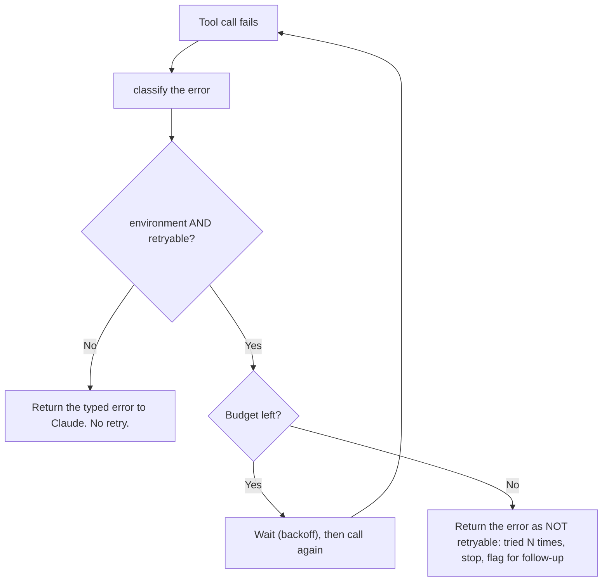
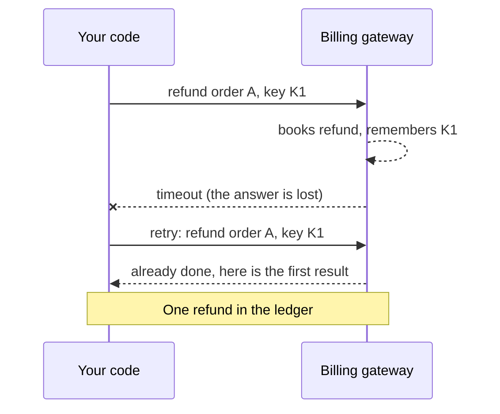

# Day 2 Study Guide: Tool Errors, Retries and Escalation

**What to do when a tool fails, and how to make failure safe**

| | |
|---|---|
| **Reading time** | About 20 minutes |
| **You should already know** | The tool-use loop and the short failure section in [`TOOL_USE_LOOP.md`](TOOL_USE_LOOP.md). Read that guide first. |
| **Class demos** | Demo 2B (the loop as a state machine) · Demo 2C (parallel tool calls) |
| **Labs** | Lab 2.3 (main) · Lab 2.2 · Lab 2.5 (see the [map in section 10](#10-guide-to-demo-to-lab-map)) |

---

## 1. Why failure needs its own guide

**Analogy: a kitchen that has a bad night.** Sometimes the kitchen cannot cook the dish. A good kitchen does not shout "Error!" through the door. It says what happened and what the diner can do next: "We are out of fish, try the chicken."

In the first guide you learned the rule: **a failure is information. Send it back with `is_error: true`.** This guide goes deeper: what kinds of failure exist, how to describe them, who decides to retry, and when to stop and ask a human. Each failure below is explained the same way: why it happened, how your code detects it, and which design decision resolves it.

## 2. The five kinds of failure

**Analogy: five kinds of trouble at the restaurant.** The cure depends on the trouble. Telling a diner "try again" when the kitchen is on fire does not help.

| Kind | Restaurant version | What it needs |
|---|---|---|
| **Bad input** | A dish that is not on the menu | Claude fixes the input, or asks the user |
| **Temporary environment problem** (timeout, lock) | The gas went off for a minute | Your code waits and tries again, a few times |
| **Permission** (not allowed, amount too high) | The diner asks for the owner's private wine | A human decides. Never retry. |
| **Tool itself broken** (a bug, a missing tool) | The oven is broken | Stop. Tell the user. Alert engineers. |
| **Ambiguous outcome** (a timeout *after* the action happened) | A tray dropped in the corridor: did the dish arrive? | Find out the truth before doing anything again |

**How you detect them.** Bad input: the tool raises "not found" or fails validation. Temporary: the exception type (a timeout, a 503, a lock). Permission: a permission error or an approval rule fires. Broken tool: an exception you did not plan for. Ambiguous: a timeout on a **write** tool, because a network call has two ends and the action can finish while the answer is lost.

The ambiguous case is the dangerous one, and section 6 is about it.

## 3. Typed errors: a note with boxes to tick

**Analogy: a hospital triage card.** A card that says "Patient is unwell" is almost useless. A card with boxes ("urgent", "can wait", "needs a specialist") and one line of advice tells every nurse what to do.

A **typed error** is that card. It is a small JSON object with the same fields every time.

```json
{"error_code": "PERMISSION_DENIED", "category": "permission", "retryable": false,
 "message": "Refund of 900.00 is above the agent limit.",
 "hint": "Do not retry and do not split the refund. Tell the customer a supervisor will review it."}
```

| Field | Plain meaning |
|---|---|
| **code** (`error_code`) | A short, stable name. It never changes between runs. Your code and your logs can match on it. |
| **category** | *Who can fix it?* Input, environment, permission or tool. |
| **retryable** | Can trying again help? `true` or `false`. |
| **message** | What went wrong, in one sentence. |
| **hint** | What to do next. Written for Claude. |

**Why plain exception text is a weak signal.** Compare `TimeoutError: gateway did not answer` with a typed error that says `category: environment`, `retryable: true`. The plain text is a sentence. Claude has to guess whether to retry, how often, and whether it is safe. Your code cannot read it at all without fragile string matching. A typed error is a **decision, written down in advance by a person who understood the failure**.

The official docs agree on the spirit. They say to write instructive error messages that say what went wrong and what Claude should try next, for example "Rate limit exceeded. Retry after 60 seconds", instead of a bare "failed".

**One more rule: fail closed.** Always add a catch-all entry for errors you did not plan for. It should say `retryable: false` and tell Claude to stop. *Analogy: a locked door is the safe default.* An unknown failure must never turn into an endless retry. Keep stack traces and file paths out of the message.

**Where the analogy stops.** Claude is a language model, so your *code* must enforce the important rules (retry limits, approval). Do not rely on the hint alone.

## 4. How Claude reacts to an error result

**Analogy: a diner who hears "we are out of fish".** The diner does not storm out. They read the reason and choose again, or ask what else is on offer. Claude does the same with an error result. The difference: a diner may choose again forever, so your code still sets the limits.

When you send `is_error: true`, Claude reads the content and carries on. In the official example, a weather tool fails, you return the error text with `is_error: true`, and Claude tells the user it could not get the weather.

Two more facts from the docs. If a tool call is invalid (for example a required input is missing), you can send a `tool_result` saying so, and Claude retries two or three times with corrections before it apologises. To stop invalid inputs at the source, add `strict: true` to the tool definition.

**The Tool Runner and exceptions.** The Tool Runner is the SDK helper that runs the loop for you (see the first guide, section 9). If your tool function raises an exception, the runner catches it. It sends Claude a `tool_result` with `is_error: true`. The content is the exception's message (in Python, its type and message), not the full stack trace. The Python SDK also logs the full exception for you.

That is helpful, and it is also the weak signal from section 3. The runner turns any exception into text. It does not know which failures are temporary or which need a human. So **you still design the typed errors, the retry rules and the idempotency key.** If you want to look at the results before they go back to Claude, the docs show `runner.generate_tool_call_response()`. If you need human approval or custom logging, the docs suggest the manual loop.

## 5. Retry: who owns it, and how

**Analogy: a delivery company and a missed parcel.** The company decides: "We try three times, one day apart, then the parcel goes back to the depot." It does not ask the parcel, and it does not try forever.

> **Your code owns the retry. Not Claude.**

Why? Claude has no clock and cannot count. A retry rule written in a prompt is slow, different each time, and has no real limit. A rule in code is fast, the same every time, and bounded.

**The three parts of a safe retry**

| Part | Meaning | Example |
|---|---|---|
| **Gate** | Retry only if the error is `environment` and `retryable` is true. | A lock, a timeout |
| **Budget** | A fixed maximum number of tries. | 3 attempts in total |
| **Backoff** | Wait longer after each failure, so you do not hammer a service that is struggling. | 0.5 s, then 1 s, then 2 s |



**Do not forget the last box.** When the budget runs out, tell Claude honestly: "we already retried, do not call this again." Otherwise Claude may try again itself, and you have an unbounded loop in a new place.


## 6. Write tools and the double-charge problem

**Analogy: a card machine that freezes.** You tap your card. The screen freezes. The money may have been taken, or it may not. If you tap again, you might pay twice.

A **read** tool (look up an order) is safe to repeat. A **write** tool (issue a refund) changes the world. Take this timeline.

1. Your code asks the billing gateway to refund order A.
2. The gateway books the refund.
3. The answer is lost. Your code sees a **timeout**.
4. A blind retry sends the refund again. The customer is refunded twice.

**Why it happened:** a timeout does not say whether the action ran. **How it is detected:** a timeout on a write tool, and later, two rows in the ledger. **Which design decision resolves it:** an idempotency key.

An **idempotency key** is a receipt number your code attaches to one intended action. The service remembers the number. The first request with that number does the work. Every later request with the same number returns the first result and does nothing new.



**Rules for the key.** Your code makes the key, not Claude: in Demo 2B it is built from the case, the tool and the arguments, so the same intended refund gets the same key even if Claude asks again later. The service behind the tool must honour it (this is a general engineering practice, not a Claude API feature). Until a write tool has a key, do not retry it automatically. Tell the user the outcome is unknown, and check status or flag it for follow-up.

For the ambiguous timeout, say so in the error. Lab 2.2 adds `outcome_unknown: true` and a hint that a retry with identical arguments is safe because of the key.

## 7. When to stop and ask a human

**Analogy: the junior waiter and the manager.** A waiter may give a free dessert. A free meal for twelve needs the manager. The waiter does not try nine small free desserts to get around the rule. They fetch the manager.

Some failures cannot be fixed by retrying, rewording or splitting the work. Permission and approval errors are the clearest. For them:

1. **Do not retry.** The answer will be the same.
2. **Do not work around it.** Splitting a large amount defeats the rule. Say so in the hint.
3. **Hand a human a complete request.** In Lab 2.3, an adjustment above the threshold becomes an **approval request**: who, how much, why, which role must approve, and which call to replay once approved. The request id is built from the idempotency key, so asking twice files only one request.
4. **Tell Claude the request id and to stop.** Claude then tells the user it is pending.

The same goes for a broken tool and for an exhausted retry budget: stop, tell the user honestly, and flag the case. Never loop.

## 8. Check the request before you send it (preflight)

**Analogy: a pilot's checklist before take-off.** A loose door is cheaper to find on the ground.

The tool-use loop has four rules for `tool_result` messages (see the first guide, section 6). Break one and the API answers with HTTP 400. The official page repeats two of them: results must come right after the matching `tool_use`, and `tool_result` blocks must come first in the user message.

A **preflight** is a small function that checks the message list **locally, before the API call**. It compares the ids Claude asked for with the ids you answered. If they do not match, it stops and tells you why, with no wasted request.

In Demo 2B, preflight catches four mistakes: an orphan result (no `tool_use` before it), a wrong `tool_use_id`, a missing result for one of several calls, and text before the results.

One more cut-off case from the stop-reason docs: if Claude's reply stops at `max_tokens` and ends with an incomplete `tool_use` block, do not run it. Retry the request with a higher `max_tokens`.

## 9. When Claude is the one who is wrong: invented references

So far the tool or the world failed. Sometimes **Claude** makes a mistake in its own reasoning. For example, it asks to book a hotel using a reservation reference that no tool ever returned. It made the reference up.

**Analogy: a diner who orders "the usual" at a restaurant they have never visited.** Why it happens: Claude fills a gap with something that looks right. How it is detected: your code keeps the values your tools really returned and checks each reference against them. The decision that resolves it: return a typed, non-retryable error (Lab 2.2 uses `UNKNOWN_REFERENCE` and `PREREQUISITE_NOT_MET`), so Claude must find the real value first.

This guide only introduces the idea. Demo 2C shows the dependent write steps in order. Day 3 goes deeper into how agents decide and plan.

## 10. Guide to demo to lab map

These pairings were checked against the current demo and lab files.

| Idea | Section | Class demo | Lab | What you do |
|---|---|---|---|---|
| Typed errors, bounded retry, escalation, preflight | 3 to 8 | **Demo 2B**: The Tool-Use Loop as a State Machine (refund assistant) | [**Lab 2.3**: Make the Payroll Agent Fail Safely](../../DAY_2/LABS/LAB_2_3_payroll_typed_errors/README.md) | Five edits: error catalogue, errors to results, retry table, approval request, preflight |
| Idempotency key and ambiguous timeout; invented references | 6, 9 | **Demo 2C**: Parallel Tool Calls Without a Double Charge | [**Lab 2.2**: Run the Tool Calls of One Turn Safely](../../DAY_2/LABS/LAB_2_2_travel_disruption_tool_loop/README.md) | Five edits, including a write gate and an idempotency key |
| Failure as a result, `is_error` | 4 | Demo 2B stage 1 | [**Lab 2.5**: Build a Tool and the Tool Loop](../../DAY_2/LABS/LAB_2_5_build_a_tool_and_loop/README.md) | A safe runner that turns crashes into results |

**Demo 2B, the failure stages.** Stage 1: the raw loop crashes on the first timeout. Stage 2: what Claude sees for a plain exception versus a typed error. Stage 3: typed errors and a bounded retry, then a timeout after the refund was booked (order ORD-1008) gives **two refund rows**. Stage 4: four broken `tool_result` messages, each rejected with HTTP 400. Stage 5 and final: preflight, idempotency key and turn limit, with eight requests checked against the ledger.

The demo injects three faults on purpose: a timeout before the refund is written (a retry recovers), one that never clears (the budget stops it), and one after the refund is written (the ambiguous case).

**Lab 2.3** runs six payroll tickets: happy path, closed pay period, typo in an employee id, amount above the approval threshold, a lock that recovers, and a lock that never clears. Judge by database calls and the ledger, not Claude's wording.

**Same idea, different field names.** The exercises were written separately. Teach yourself the idea, then use this table so nothing surprises you.

| Exercise | Code field | Category | Retry flag | Hint | Extra fields |
|---|---|---|---|---|---|
| **Demo 2B** | `error_code` | `category` (tool, input, permission, environment) | `retryable` | `hint` | `message` |
| **Lab 2.3** | `error_code` | `category` (same four) | `retryable` | `hint` | `message`, `details` |
| **Lab 2.2** | `error` | none | `retryable` | `hint` | `message`, `outcome_unknown` (timeout) |
| **Lab 2.5** | `error` (a short word such as `book_not_found`) | none | none | none | the fields of the item |

Two differences worth knowing:

- In Demo 2B, category `tool` means "our own tool is broken or missing". In Lab 2.3, it is also used for `PAY_PERIOD_CLOSED`, a business rule that will not change. Both mean "retrying will not help", but read each exercise's own definition.
- In Demo 2B and Lab 2.2, the harness makes the idempotency key. In Lab 2.3, the key is an input field that Claude fills in from the ticket number, and the tool description says to reuse it for a retry.

## 11. Your first typed error and bounded retry

**Analogy: the waiter's rulebook for a bad night.** Read the error, wait if the rulebook says so, stop when it says stop. This code is for a **read** tool only.

```python
import json
import time

def classify(exc):                               # turn any exception into a typed error
    if isinstance(exc, KeyError):                # the id was wrong: the INPUT can be fixed
        return {"error_code": "NOT_FOUND", "category": "input", "retryable": False,
                "message": f"No record {exc}.", "hint": "Ask the user to check the id. Do not guess."}
    if isinstance(exc, PermissionError):         # not allowed: only a human can say yes
        return {"error_code": "PERMISSION_DENIED", "category": "permission", "retryable": False,
                "message": "Not allowed.", "hint": "Do not retry. Say a supervisor will review it."}
    if isinstance(exc, TimeoutError):            # the world is flaky: waiting may help
        return {"error_code": "TIMEOUT", "category": "environment", "retryable": True,
                "message": "The service was too slow.", "hint": "Temporary problem."}
    return {"error_code": "TOOL_INTERNAL_ERROR", "category": "tool", "retryable": False,
            "message": "The tool failed unexpectedly.", "hint": "Do not retry. Tell the user."}

def run_read_tool(tool, args, max_attempts=3, base_delay=0.5):   # for READ tools only
    for attempt in range(1, max_attempts + 1):
        try:
            return json.dumps(tool(**args)), False                # (content, is_error)
        except Exception as exc:                                  # never let a failure escape
            err = classify(exc)
            if err["retryable"] and attempt < max_attempts:
                time.sleep(base_delay * 2 ** (attempt - 1))       # wait 0.5 s, then 1 s
                continue
            if err["retryable"]:                                  # budget used up: say so honestly
                err.update(retryable=False, hint=f"Tried {attempt} times. Do not call again. Tell the user.")
            return json.dumps(err), True
```

**What to notice**

1. `classify` is the only place that knows about Python exceptions. Everything after it deals with typed errors.
2. The last `return` in `classify` is the **fail-closed** default.
3. Only an `environment` error with `retryable: True` is retried. Waits double each time.
4. When the budget ends, the error is **rewritten** to `retryable: False`, with a hint to stop.
5. The function returns `(content, is_error)`. Put them into the `tool_result` block from the first guide.

**Expected output.** A tool that times out twice and then works returns the real result, after waits of 0.5 s and 1 s. `KeyError("A7")` returns `NOT_FOUND` at once, with `is_error` true. A tool that always times out returns `TIMEOUT` with `retryable` false and "Tried 3 times". `PermissionError` and unexpected errors return their typed error with no retry.

## 12. Knowledge check

1. A refund tool times out after the gateway has booked the refund. Your code retries. What happens, and what makes it safe?
2. Why is `TimeoutError: gateway did not answer` a weaker signal than a typed error?
3. A tool keeps returning `PAYROLL_DB_LOCKED`. Who decides how many times to try, and what must happen after the last try?
4. A pay adjustment is above the approval limit. Claude suggests paying it in three smaller parts. What should your design do?
5. A `tool_result` has the wrong `tool_use_id`. Which design step would have caught it before the API did?
6. Your tool function raises an exception inside the Tool Runner. What does Claude receive, and what do you still have to design?

**Answers**

1. The customer is refunded twice. An idempotency key, made by your code, lets the second request return the first result without a new refund.
2. It is only a sentence. Claude must guess whether a retry is safe, and your code cannot act on it. A typed error states the category, the retry flag and the next step.
3. Your code decides, with a budget and backoff. After the last try, return the error as not retryable and tell Claude to stop and flag the case.
4. Refuse and escalate. Build a complete approval request for a human, tell Claude the request id and to stop. The hint says "do not split", and the code enforces the limit.
5. Preflight: it compares the asked ids with the answered ids locally.
6. The runner catches it and sends `is_error: true` with the exception's message (type and message in Python), not the stack trace. You still design the typed errors, the retry rules and the idempotency key.

## 13. Key takeaways

1. A failure is information. Say what kind it is: input, environment, permission, tool, or ambiguous.
2. Use typed errors with a code, category, retryable flag, message and hint. Fail closed for the unknown.
3. Your code owns retries: a gate, a budget and backoff. When the budget ends, tell Claude to stop.
4. A write tool must not be retried after a timeout without an idempotency key.
5. Permission and approval errors go to a human with a complete request. Never loop or work around.
6. Check the request locally (preflight) before sending. Judge runs by what really happened, not by Claude's wording.

## 14. Official references

- [Handle tool calls](https://platform.claude.com/docs/en/agents-and-tools/tool-use/handle-tool-calls)
- [Troubleshooting tool use](https://platform.claude.com/docs/en/agents-and-tools/tool-use/troubleshooting-tool-use)
- [Tool runner (SDK)](https://platform.claude.com/docs/en/agents-and-tools/tool-use/tool-runner)
- [Stop reasons](https://platform.claude.com/docs/en/build-with-claude/handling-stop-reasons)
