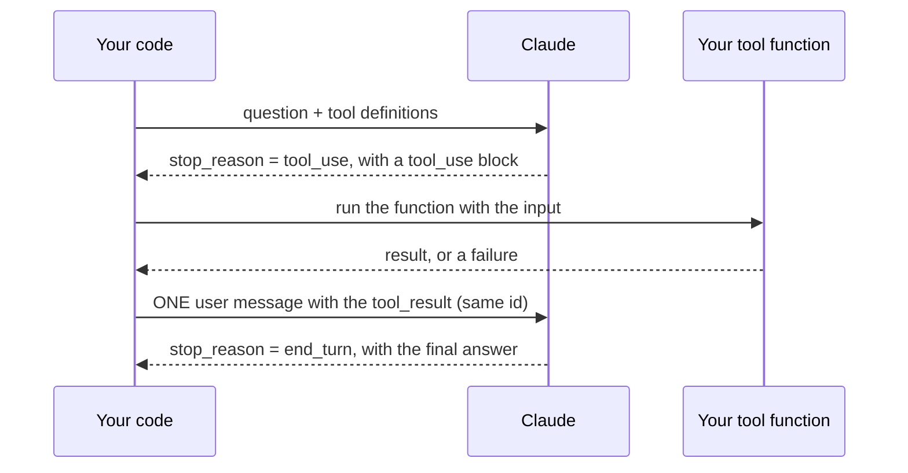
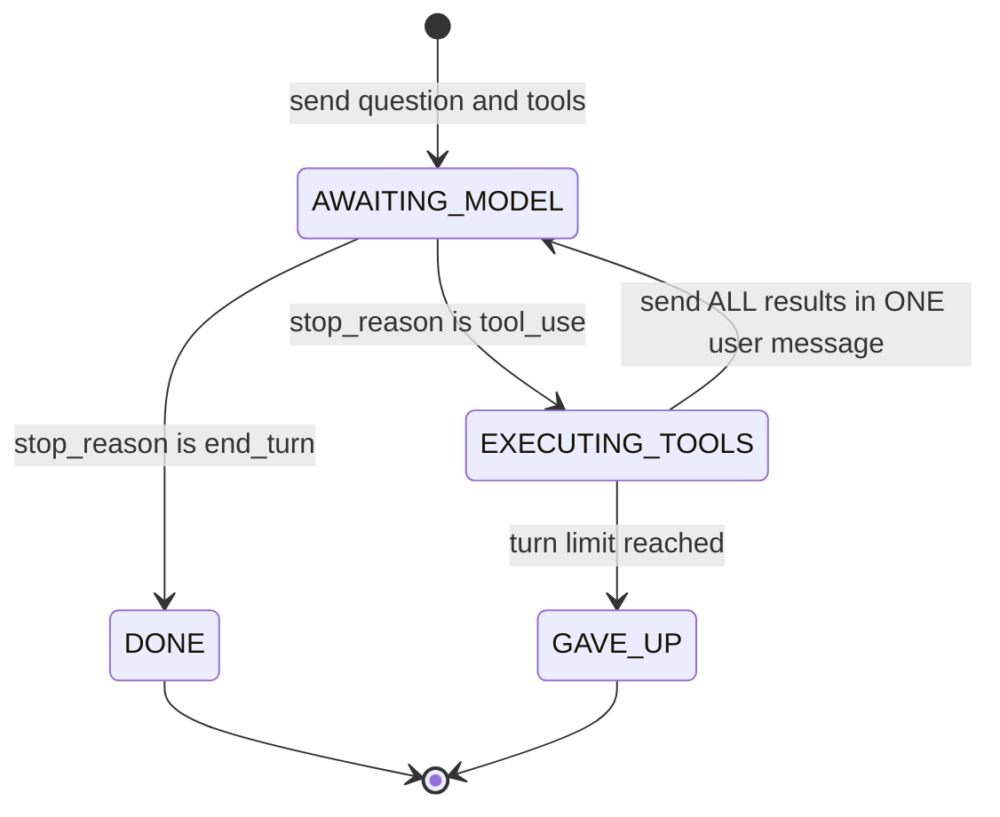
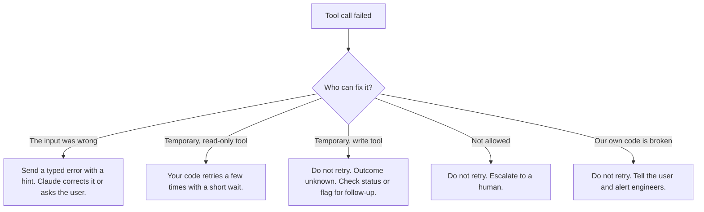

# Day 2 Study Guide: The Tool-Use Loop

**How Claude asks for help, and how your code answers**

| | |
|---|---|
| **Reading time** | About 18 minutes |
| **You should already know** | How to send one message to Claude with `client.messages.create` (Day 1) |
| **Class demos** | Demo 2A (tool design) · Demo 2B (the loop) · Demo 2C (parallel calls) |
| **Labs** | Lab 2.1 · Lab 2.5 · Lab 2.3 · Lab 2.2 (see the [map in section 10](#10-guide-to-demo-to-lab-map)) |
| **Next** | MCP: see the guides in [`../../STUDY_GUIDE/`](../../STUDY_GUIDE/) |

---

## 1. Why tools exist

**Analogy: a brilliant consultant locked in a room.** She knows a lot. But she has no phone and no computer. She cannot look up your customer, and she cannot send an email. All she can do is pass notes under the door: "Please find out X for me."

Claude is that consultant. It only knows what it learned in training and what is in the conversation. It cannot see your database, and it cannot *do* things like issue a refund.

**Tools are the notes under the door.** Claude writes a note asking for something. Your program does the work and slides the answer back.

**When should you use a tool?**

- Claude must **do something**: send an email, update a record.
- Claude needs **fresh or private data**: today's prices, your orders.
- You need an answer in a **fixed shape**, like JSON with set fields.
- You need to call an **existing system**: a database or an internal API.

**When should you not?** If Claude already knows the answer (translation, summaries, general knowledge), a tool only adds delay. It is like phoning the kitchen to ask for the water that is already on your table.

A warning sign from the docs: if you are writing a regex to dig a decision out of Claude's text, that decision should have been a tool call.

## 2. The big idea: Claude asks, your code acts

**Analogy: a restaurant.**

| In the restaurant | In tool use |
|---|---|
| The **diner** reads the menu and orders. The diner cannot enter the kitchen. | **Claude** |
| The **menu** says what each dish is and when to order it. | Your **tool definitions** |
| The **order ticket** has a number, a dish and details. | A **`tool_use`** block (`id`, `name`, `input`) |
| The **kitchen** cooks and sends the dish out with the same ticket number. | Your **code**, and its **`tool_result`** |

Claude never runs anything. It only asks. Claude also never sees your code. It sees only the menu (your schema) and the dish that comes back (your result).

**Where the analogy stops.** A real diner remembers the meal. The API does not. Every request must include the whole conversation again.

**Four words to know**

| Word | Simple meaning |
|---|---|
| **Tool definition** | A menu entry: a `name`, a `description`, and an `input_schema` (the details Claude must give) |
| **`tool_use`** | Claude's order ticket |
| **`tool_result`** | Your answer to one ticket, with the same id in `tool_use_id` |
| **`stop_reason`** | Why Claude stopped. `tool_use` = "waiting for you". `end_turn` = "I'm done." |

## 3. Who runs the tool? Client tools and server tools

**Analogy: a restaurant with its own kitchen, plus dishes delivered by a caterer.**

| | Client tools | Server tools |
|---|---|---|
| **Who runs it** | Your program | Anthropic |
| **Restaurant version** | Your own kitchen cooks it | The caterer cooks it and sends it ready |
| **Your job** | Run it and send back a `tool_result` | Nothing. You never write a `tool_result`. |
| **Examples** | Your own functions (`find_book`). Also Anthropic's `bash` and `text_editor`. | Web search, web fetch, code execution |

Why use Anthropic's own client tools like `bash`? Claude was trained on that exact format, so it uses them more reliably.

A server tool runs its own loop inside Anthropic. If it runs too long, the reply says `stop_reason: "pause_turn"`. Think of the caterer saying "still cooking, ask me again." You send the conversation back, and Claude carries on. Your own tools never cause `pause_turn`. They always give `tool_use`.

**This course is about client tools.** That is where your design decisions are.

## 4. Writing a good tool description

**Analogy: signs in a building.** A sign that says "Office" helps nobody. A sign that says "Billing office, floor 2, invoice questions only" sends people the right way.

Claude picks a tool by reading its description. It cannot see your code. The docs call the description "by far the most important factor in tool performance."

A good description says:

- what the tool does,
- **when to use it and when not to**,
- what each input means,
- any limits.

Aim for 3 to 4 sentences, and more for complex tools.

| Weak sign | Strong sign |
|---|---|
| "Look up a book." | "Look up one book by title: its shelf code and how many copies are available. Use when someone asks where a book is. Read-only." |

**Three more tips:**

- **Fewer, clearer tools.** Merge near-duplicates into one tool with an `action` input. *Analogy: one clearly labelled door beats three doors that all say "Entrance".* This is Demo 2A and Lab 2.1.
- **Name by area.** `orders_get` and `billing_get` cannot be confused.
- **Send back only what Claude needs.** *Analogy: hand the diner the dish, not the whole pantry.*

## 5. Should Claude be forced to use a tool? (`tool_choice`)

**Analogy: a waiter who suggests, or a waiter who insists.**

| Setting | Meaning | Waiter says |
|---|---|---|
| `auto` (default) | Claude decides | "Order what you like." |
| `any` | Claude must use some tool | "You must order something." |
| `tool` | Claude must use one named tool | "You must order the soup." |
| `none` | No tools | "No food today." |

**Important:** on Claude Opus 5.5, Sonnet 5.5, Fable 5.1 and Mythos 5.1, `any` and `tool` give an HTTP 400 error. Use `auto`. If you need a guaranteed shape, add `strict: true` to the tool, or use structured outputs.

## 6. The loop

**Analogy: a meal with several courses.** The diner orders, the kitchen brings the dish, the diner orders again. The meal ends when the diner stops ordering, or when the restaurant closes (your turn limit).

Claude often needs more than one call. So your program repeats these steps:

1. Send the question and the tools.
2. Claude replies `stop_reason: "tool_use"` with one or more tickets.
3. Your code runs each tool.
4. Send everything back, plus the results in one user message.
5. Go to step 2, as long as Claude still says `tool_use`.

The loop ends on any other `stop_reason`. Normally that is `end_turn`.



The demo and Lab 2.5 print these three states, so it helps to know them:



**Four rules. Break one and the API answers with HTTP 400.**

**Analogy: a tray with matching ticket numbers.** The dishes must arrive on the tray *right after* the order, each with its own ticket number, all together, with the plates first and anything extra afterwards.

1. The results go in the user message **right after** the assistant message that asked.
2. Each `tool_use_id` matches the ticket's `id`.
3. If Claude asked for several tools, **all** results go in **one** user message.
4. In that message, `tool_result` blocks come **first**. Any text comes after.

**Your own exit.** The API will never stop a loop that goes in circles. Add a turn limit (`MAX_TURNS`). *Analogy: closing time.*

## 7. Your first loop

**Analogy: the waiter's routine.** Take the ticket, cook the dish, bring it back with the same ticket number, and stop when the diner stops ordering. The code below is exactly that routine, for a tiny library assistant. You will build it in Lab 2.5.

```python
import json
import anthropic

client = anthropic.Anthropic()          # reads ANTHROPIC_API_KEY from your environment
MODEL = "claude-sonnet-5-5"             # the model the labs use
MAX_TURNS = 6                           # your own exit
SHELVES = {"dune": "SF-12", "emma": "CL-03"}

def find_book(title):                   # your real function: no Claude in here
    shelf = SHELVES.get(title.strip().lower())
    return {"title": title, "shelf": shelf} if shelf else {"error": "book_not_found", "title": title}

tools = [{"name": "find_book",
          "description": "Look up one book by title: its shelf code. Use when someone asks where a book is. Read-only.",
          "input_schema": {"type": "object",
                           "properties": {"title": {"type": "string", "description": "Book title, e.g. Dune"}},
                           "required": ["title"]}}]

messages = [{"role": "user", "content": "Where is Dune shelved?"}]

for turn in range(1, MAX_TURNS + 1):
    response = client.messages.create(model=MODEL, max_tokens=2048, tools=tools, messages=messages)
    if response.stop_reason != "tool_use":                                  # Claude answered: done
        break
    messages.append({"role": "assistant", "content": response.content})    # keep Claude's own turn
    results = []
    for block in response.content:
        if block.type == "tool_use":                                        # replies can also contain text blocks
            output = find_book(**block.input)                               # YOUR code does the work
            results.append({"type": "tool_result", "tool_use_id": block.id, "content": json.dumps(output)})
    messages.append({"role": "user", "content": results})                  # ALL results, ONE message

print("".join(b.text for b in response.content if b.type == "text"))
```

**Four things to notice:**

1. `tools=tools` goes in **every** request. Claude only knows the tools you show it each time.
2. The loop stops when `stop_reason` is not `tool_use`, or when `MAX_TURNS` runs out.
3. `find_book(**block.input)` is the moment your code acts.
4. `block.id` becomes `tool_use_id`. That is the ticket number.

**What you should see.** Claude's ticket (the id changes each run):

```json
{"type": "tool_use", "id": "toolu_01A...", "name": "find_book", "input": {"title": "Dune"}}
```

Your answer:

```json
{"type": "tool_result", "tool_use_id": "toolu_01A...", "content": "{\"title\": \"Dune\", \"shelf\": \"SF-12\"}"}
```

Then Claude says something like "Dune is on shelf SF-12." The wording changes between runs. The shelf code does not, because your function produced it.

> **Checkpoint:** Who runs `find_book`? Why do you add Claude's message before the results? (Answers in section 12.)

## 8. When a tool fails

**Analogy: the kitchen tells the diner what went wrong.** "We are out of that dish" and "the kitchen is on fire" are very different news. A good kitchen tells the diner honestly, so the diner can choose again, wait, or leave.

> **A failure is information. Send it back with `is_error: true`. Never crash, and never hide it.**

Claude reads the error. It can fix its input and retry, ask the user, or explain the limit. The official tutorial shows a calendar tool that refuses an event with more than 10 attendees. Claude tells the user and offers to split the event in two. The `is_error` flag is the only difference from a success.

If you decide not to run a call, still send a `tool_result` for it with `is_error: true`. Every ticket needs an answer.

The smallest version replaces the two lines in the loop that call the tool and build the result:

```python
try:
    result = find_book(**block.input)
    content, is_error = json.dumps(result), "error" in result               # the tool itself reported a problem
except Exception as exc:                                                    # a crash becomes information, not the end
    content, is_error = json.dumps({"error": "tool_crashed", "detail": str(exc)}), True
results.append({"type": "tool_result", "tool_use_id": block.id, "content": content, "is_error": is_error})
```

**Not all failures are the same. Ask: who can fix it?**



A **typed error** is a small, clear message: a code, a "can a retry help?" flag, and a hint.

```json
{"error_code": "PERMISSION_DENIED", "category": "permission", "retryable": false,
 "hint": "Do not retry. Tell the customer a supervisor will review the case."}
```

**Three ideas to remember:**

1. **Your code owns the retry rules, not Claude.** *Analogy: the delivery company decides how many times to re-deliver a parcel. It does not ask the parcel.* Claude has no clock and cannot count. A rule in code is fast, the same every time, and has a limit.
2. **Be careful with write tools.** *Analogy: a card machine freezes after taking your money. If you swipe again, you pay twice.* If `issue_refund` times out, the refund may already be done. An **idempotency key** fixes this. It works like a receipt number: the same request with the same number returns the first result and does nothing new. Until a write tool has one, do not retry it automatically.
3. **Tool results are data, not orders.** *Analogy: a customer note pinned to a dish is not an instruction to the chef.* Keep instructions in your system prompt or user message, not in tool results.

## 9. Tool Runner or your own loop?

**Analogy: an automatic car or a manual one.** Automatic handles the gears for you. Manual gives you control when you need it.

| | Tool Runner | Your own loop |
|---|---|---|
| **What it is** | The SDK runs the loop, wraps errors, and builds the schema from your function | You write the loop (this guide) |
| **Good for** | Less code. About half the lines in the official tutorial. | Human approval, custom logging, or conditional running |

Learn the manual loop first, so you know what the Tool Runner hides. Even with the Tool Runner, you still design the typed errors, the retry rules and the idempotency key. Demo 2B stage 2 shows this.

## 10. Guide to demo to lab map

Each idea above appears in class and in a lab.
| Idea | Section | Class demo | Lab | What you do in the lab |
|---|---|---|---|---|
| Good tool descriptions | 4, 5 | **Demo 2A**: Bad Tool Architecture to Good | **Lab 2.1**: Fix the Tool Boundaries of the Facilities Assistant | Rewrite descriptions, merge tools, scope tools per desk, and measure which tool Claude picks on 16 prompts |
| The loop, and failures | 6, 8 | **Demo 2B**: The Tool-Use Loop as a State Machine | **Lab 2.3**: Make the Payroll Agent Fail Safely | Five edits: error catalogue, errors to results, retry limits, an approval request for a human, and a check before each request |
| Many calls in one turn | 6, 8 | **Demo 2C**: Parallel Tool Calls Without a Double Charge | **Lab 2.2**: Run the Tool Calls of One Turn Safely | Five edits: a new tool definition, a concurrent executor for reads, a gate for dependent writes, an idempotency key, a turn limit |
| Build the loop yourself (optional) | 6, 7, 8 | Continues Demos 2B and 2C | **Lab 2.5**: Build a Tool and the Tool Loop | Four edits, about 30 lines (next table) |
| What comes next | | | **Lab 2.6** | The same loop, but the tools come from an MCP server |

**Lab 2.5, edit by edit**

| Edit | You write | Idea |
|---|---|---|
| TODO 1 | The schema for `check_due_date` | A tool description (section 4) |
| TODO 2 | The function that runs what Claude named | "Your code acts" (sections 2, 7) |
| TODO 3 | The loop that sends all results in one message | The loop (sections 6, 7) |
| TODO 4 | A safe runner that turns errors into results | Failure is information (section 8) |

The lab prints its progress. Stage 1 (no tools) answers 1 of 4 questions with real data. After your loop in stage 3, all 4 are answered. Stage 4 shows errors flagged with `is_error` and a runaway loop stopped after 6 turns.

**Demo 2B, stage by stage.** The demo has a lot of helper code. You do not need to read it. Each stage is the loop from section 7 plus one idea.

| Stage | What you watch | Idea |
|---|---|---|
| 1 | A refund, two lookups at once, then the raw loop crashing on the first failure | The loop |
| 2 | What Claude sees for a plain exception versus a typed error | Tool Runner, typed errors |
| 3 | A retry that causes a duplicate refund after a timeout | Retry rules, write tools |
| 4 | Four broken `tool_result` messages, each rejected with HTTP 400 | The four rules in section 6 |
| 5 and final | A check before each request, an idempotency key, a turn limit | A safe loop |

Tip: judge each run by what really happened (the ledger), not by how Claude worded its answer.

**Suggested route if the loop is new to you.** The course lists Lab 2.5 last, and it is optional. We suggest: read sections 1 to 9, watch Demo 2B, do **Lab 2.5**, then Labs 2.3, 2.2 and 2.1. This is only a suggestion.

**Different field names.** The demo and labs name error fields a little differently (`error_code`, `error`). The idea is the same: a code, a retry flag, and a hint.

## 11. Common mistakes

| Mistake | You see | Fix |
|---|---|---|
| Result with no matching `tool_use` just before it | HTTP 400 | Add Claude's message first |
| Wrong `tool_use_id` | HTTP 400 | Always use `block.id` |
| Asked for two tools, answered one | HTTP 400 | One `tool_result` per `tool_use` |
| Text before the results | HTTP 400 | Results first, text after |
| Results in several messages | Error, or no more parallel calls | One message for all results |
| Tool error escapes the loop | The whole run crashes | Catch it, send `is_error: true` |
| Retrying everything | Duplicate actions | Retry only temporary read-only failures |
| No turn limit | A loop that never ends | `range(1, MAX_TURNS + 1)` |
| Running a cut-off call (`stop_reason` is `max_tokens`) | Half-formed arguments | Do not run it. Raise `max_tokens`. |
| Claude never calls your tool | Your data is ignored | Check for duplicate names and vague schemas. Add `input_examples`. |
| Claude picks the wrong tool | Wrong action | Sharpen the descriptions: say *when* to use each |
| Claude invents inputs | Failed validation | Add `strict: true`, shrink the enum, or add `input_examples` |

The first four rows are the four HTTP 400 cases in Demo 2B stage 4. Learn the rule, not the error wording.

## 12. Knowledge check

1. In the restaurant analogy, who runs `find_book`? Why add Claude's message before the results?
2. What is the difference between a client tool and a server tool?
3. Claude asks for two lookups at once. You send two separate user messages. What goes wrong?
4. A tool keeps failing and your loop never stops. What was missing?
5. `issue_refund` times out and your code retries it. What can happen? What makes it safe?
6. Claude keeps picking the wrong tool. Name two fixes before you change the model.

**Answers**

1. Your code. Without Claude's message, the result has no matching ticket before it, so the API rejects it.
2. Client tools run in your program and need a `tool_result`. Server tools run at Anthropic and need none.
3. All results of one turn must go in one user message. Splitting them is an error.
4. A turn limit.
5. The refund may already be done, so the customer could be refunded twice. An idempotency key makes a repeat return the first result.
6. Rewrite the descriptions (say when to use each tool), and merge or remove overlapping tools. That is Demo 2A and Lab 2.1.

## 13. Key takeaways

1. Claude asks. Your code acts.
2. Client tools run on your side. Server tools run at Anthropic.
3. The description is the most important part of a tool.
4. Loop while `stop_reason` is `tool_use`. Add a turn limit.
5. Every ticket gets one answer, with the same id, and all answers go in one message.
6. A failure is information. Your code decides about retries. Writes need an idempotency key.

## 14. Official references

- [How tool use works](https://platform.claude.com/docs/en/agents-and-tools/tool-use/how-tool-use-works)
- [Tutorial: Build a tool-using agent](https://platform.claude.com/docs/en/agents-and-tools/tool-use/build-a-tool-using-agent)
- [Define tools](https://platform.claude.com/docs/en/agents-and-tools/tool-use/define-tools)
- [Handle tool calls](https://platform.claude.com/docs/en/agents-and-tools/tool-use/handle-tool-calls)
- [Troubleshooting tool use](https://platform.claude.com/docs/en/agents-and-tools/tool-use/troubleshooting-tool-use)
- [Tool runner (SDK)](https://platform.claude.com/docs/en/agents-and-tools/tool-use/tool-runner)
- [Stop reasons](https://platform.claude.com/docs/en/build-with-claude/handling-stop-reasons)
